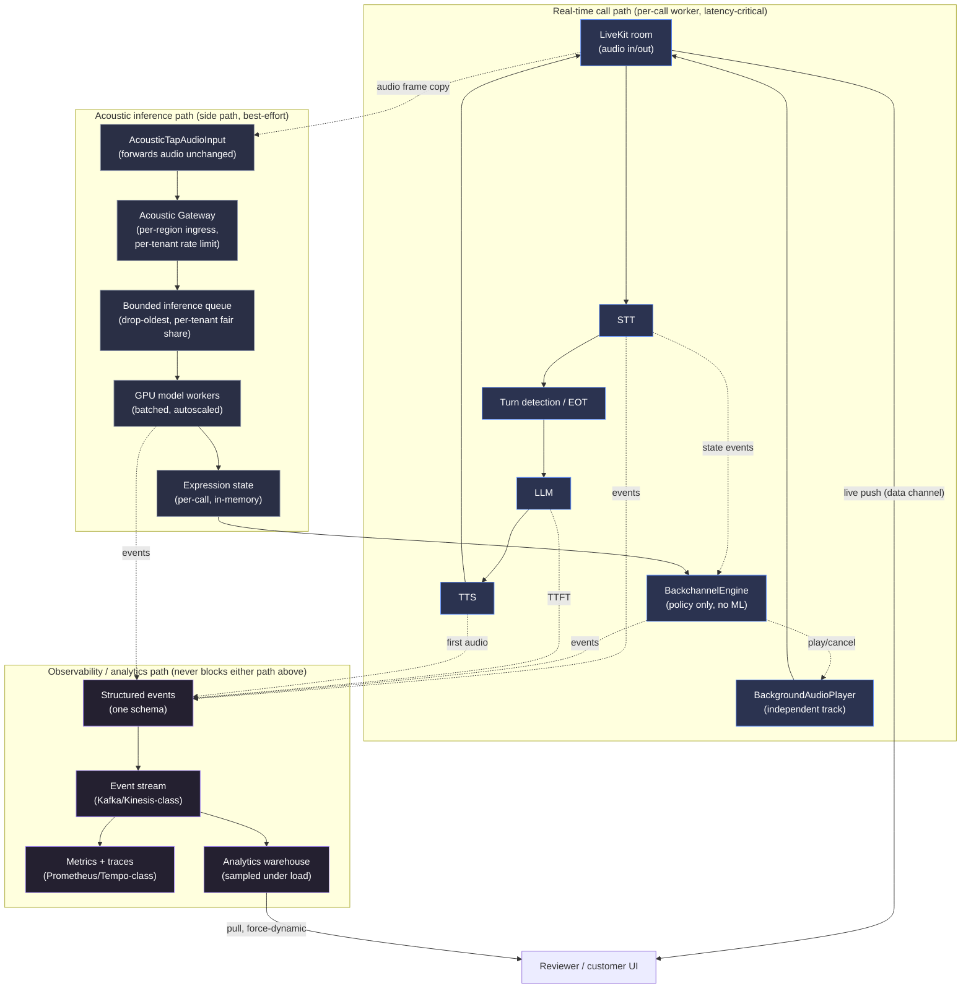
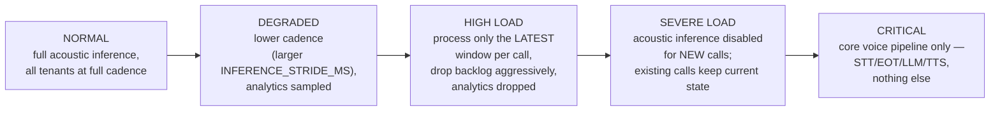

# Backchanneling + Real-Time Acoustic Intelligence for LiveKit Agents

Blue Machines SDE-1 assignment (Part 1, below) plus the SDE Assignment 2 extension, **Real-Time Acoustic Intelligence** (Part 2, further down — [jump there](#part-2--real-time-acoustic-intelligence)). Part 1 is a `BackchannelEngine` that lets a LiveKit voice agent say "mm-hmm" / "okay" / "right" while the user is still talking, without polluting the LLM's conversation context, without private LiveKit APIs, and without slowing down the agent's real response. Part 2 builds a streaming acoustic-expression system on top of it — frustration/uncertainty/energy signals from prosody, not transcript — and uses one of them to drive that same backchannel policy, without becoming part of the critical path.

All numbers below come from a real benchmark against real AWS services (Bedrock, Polly, Transcribe) and a real LiveKit Cloud project. Where something is scripted rather than measured, it's labeled. Part 2 follows the identical philosophy — see its own "Benchmark methodology" section for exactly what's real vs. scripted vs. clearly-labeled-synthetic there.

## Contents

1. [Architecture](#architecture)
2. [Backchannel decision policy](#backchannel-decision-policy)
3. [State machine](#state-machine)
4. [Race conditions & cancellation](#race-conditions--cancellation)
5. [Async task management](#async-task-management)
6. [Audio strategy](#audio-strategy)
7. [Benchmark methodology & fairness](#benchmark-methodology--fairness)
8. [Latency & behaviour metrics](#latency--behaviour-metrics)
9. [Results](#results)
10. [What became slower with backchanneling?](#what-became-slower-with-backchanneling)
11. [Known limitations](#known-limitations)
12. [Production considerations](#production-considerations)
13. [Bonus: TTS vs. cached audio, regression detection](#bonus-tts-vs-cached-audio-regression-detection)
14. [How to run everything](#how-to-run-everything)

---

## Architecture

```
apps/agent/                  Python 3.12, livekit-agents 1.8.3 + livekit-plugins-aws 1.8.3
  backchannel/
    engine.py                BackchannelEngine — decision policy + async lifecycle, no LiveKit imports
    state_machine.py          explicit EngineState transition table
    config.py                 every threshold, one dataclass, env/JSON overridable
    eot.py                    EndOfTurnEstimator — our own heuristic EOT-probability signal
    audio_provider.py         BackchannelAudioProvider ABC + CachedAudioProvider + TTSAudioProvider
    events.py                 shared Event/EventType schema
    instrumentation.py        EventRecorder: InMemory (tests) / Jsonl (live) / Sqlite (benchmark + UI)
  livekit_adapter.py          the only file that touches real LiveKit objects
  aws_providers.py            wires livekit-plugins-aws to real Bedrock/Polly/Transcribe
  worker.py                   LiveKit entrypoint — baseline & backchannel modes, mode from room metadata
  cached_clips/               pre-rendered Polly clips: mm-hmm, right, okay, yeah, got-it
  tests/                      pytest — all 15 required behaviors, no live network/AWS/LiveKit calls

benchmarks/                   scenarios.py, replay_runner.py, aggregate.py, regression_check.py, cli.py
apps/web/                     Next.js 15 + TypeScript — Overview, Scenarios, Compare, Run timeline, Live Demo
data/benchmark.sqlite         shared DB, written by Python, read-only from the web app
```

`backchannel/` has zero LiveKit imports. Every public method on `BackchannelEngine` takes plain data, and every effect goes through the `BackchannelAudioProvider` interface — that's what makes the engine unit-testable without a live connection, and keeps `livekit_adapter.py` a thin, auditable bridge instead of engine logic smeared across `AgentSession` callbacks.

```
mic → STT (Transcribe) → turn_detection="stt" → LLM (Nova) → TTS (Polly) → main audio track
        │  public AgentSession events: user_state_changed, user_input_transcribed, agent_state_changed
        ▼
  BackchannelEngine (pure Python)  →  play(phrase) / handle.stop()  →  BackgroundAudioPlayer
                                                                        (own audio track, public API)
```

The backchannel path is a **side branch**, not a stage in the main pipeline — the real response's STT→LLM→TTS chain never awaits anything the engine does. That's the entire architectural answer to "does backchanneling slow down the real response."

## Backchannel decision policy

Inputs, all from public events: speech duration this turn, time since the last transcript update, punctuation/continuation shape of the latest transcript, current `AgentState`, time since the last backchannel, backchannels so far this turn.

`tick()` computes an EOT-probability score (`0.6·silence + 0.3·punctuation + 0.1·duration`, each in `[0,1]`), then checks in order:

```
SUPPRESS if speech_duration_ms    < MIN_SPEECH_DURATION_MS          → "speech_too_short"
SUPPRESS if time_since_last_bc    < BACKCHANNEL_COOLDOWN_MS         → "cooldown_active"
SUPPRESS if eot_probability       >= MAX_EOT_PROBABILITY            → "high_eot_probability"
SUPPRESS if silence_gap_ms        >= EOT_SILENCE_WINDOW_MS - SUPPRESS_NEAR_EOT_MS → "near_eot_silence_window"
SUPPRESS if agent_state in (thinking, speaking)                     → "agent_responding"
SUPPRESS if backchannels_this_turn >= MAX_BACKCHANNELS_PER_TURN     → "max_backchannels_per_turn_reached"
otherwise SELECT, pick a phrase (not the last one used), schedule playback
```

Every decision is logged with `speechDurationMs`, `eotProbability`, `timeSinceLastBackchannelMs`, `agentState`, `reason: [...]`. All thresholds live in one place, `BackchannelConfig` (env/JSON overridable).

**Why not LiveKit's own EOT signal?** The installed `livekit-agents==1.8.3` wheel defines `EotPredictionEvent` and `_AgentBackchannelOpportunityEvent` internally, but neither is in the public `EventTypes` union `AgentSession.on()` can subscribe to — the source routes them to an internal `_session_host` with a `# TODO: replace with the public eot_prediction event once it lands` comment. Confirmed-private, unreleased, so we built our own estimator, which is what the brief asks for anyway.

## State machine

```
IDLE → USER_SPEAKING → BACKCHANNEL_CANDIDATE ─┬→ BACKCHANNEL_PENDING → BACKCHANNEL_PLAYING → USER_SPEAKING (clip finished)
              │                                └→ USER_SPEAKING (suppressed)
              ├→ EOT_DETECTED → AGENT_RESPONDING → IDLE
   (PENDING/PLAYING) → CANCELLED ─┬→ USER_SPEAKING (turn continues)
                                   └→ EOT_DETECTED
SHUTDOWN reachable from every state.
```

Explicit adjacency table (`state_machine.py`); illegal transitions raise `InvalidTransition` instead of silently no-op'ing. Includes a "false EOT" recovery path (`EOT_DETECTED → USER_SPEAKING`) for when the user resumes talking before the agent's real response starts.

## Race conditions & cancellation

The race the assignment poses directly: *backchannel selected → audio starts → user finishes → agent needs to respond.* **The real response always wins.** Two independent signals can trigger cancellation — user turn ending, or `AgentState` moving to `thinking`/`speaking` — either one is sufficient.

Cancellation is real `asyncio.Task.cancel()`, not a flag. `_play_backchannel()` wraps the entire attempt (including the network call for `TTSAudioProvider`) in one task; cancelling it raises `CancelledError` at whatever await point it's sitting on, mid-synthesis included. A test proves this directly: start a backchannel with an artificial synthesis delay, invalidate the turn mid-delay, assert playback never happened.

If nothing is audible yet, cancellation is unconditional. If a clip is already playing, the decision depends on `CANCEL_ON_EOT` (default `True`, stop immediately) vs. the soft alternative (`False`: let it finish if past `BACKCHANNEL_AUDIBLE_GRACE_MS`, logged as `BAD_BACKCHANNEL` for visibility). Either way, `_cancel_pending()` never stops the handle or logs the cancellation itself — cancelling the task is what makes `_play_backchannel`'s own handler do both, exactly once. (An earlier version did both from two places, double-counting every cancellation, and cancelled the task unconditionally before checking the policy, which silently broke the soft alternative. Both fixed, both covered by dedicated tests.)

Every candidate carries a `turn_id`/`decision_id`; a task that resolves after its turn has moved on checks staleness before ever marking the handle as playing.

## Async task management

STT/state events only update an in-memory snapshot, never schedule async work directly. One periodic evaluator (`engine.run()`) calls `tick()` at most every `MIN_TIME_BETWEEN_DECISIONS_MS` (200ms default); `tick()` bails immediately if a decision/playback is already in flight, so at most one backchannel is ever active. A test fires 200 interim-transcript events synchronously and asserts zero tasks were created.

`engine.shutdown()` cancels the evaluator and any pending playback task, awaits both, then transitions to `SHUTDOWN` — tested mid-STT-event, mid-generation, and mid-agent-response.

## Audio strategy

Two `BackchannelAudioProvider` implementations behind one interface:

- **`CachedAudioProvider`** (default) — plays a pre-rendered clip (`scripts/generate_cached_clips.py`, run once against Polly). No network round trip before "audible."
- **`TTSAudioProvider`** — synthesizes on demand via an injected callable. More flexible for new phrases/languages, but the synthesis latency sits directly in front of "audible" (see [Bonus](#bonus-tts-vs-cached-audio-regression-detection) for the measured cost).

`BackgroundAudioPlayer` (public LiveKit API) publishes its own independent audio track, never touches `ChatContext` — no code path exists from a backchannel into the LLM's conversation history, and a test greps the engine's own source to make sure that stays true.

## Benchmark methodology & fairness

10 deterministic scenarios (`benchmarks/scenarios.py`): short_answer, long_monologue, approaching_eot, mid_sentence_pause, fast_speaker, noisy_audio, long_speech_multiple_opportunities, user_stops_as_backchannel_about_to_play, cooldown_repeated_ack, agent_response_starts_immediately (8 required + 2 extra). Each is a scripted timeline of interim/final transcript events, identical for both configs.

For each `(scenario, config)`, `replay_runner.run_one()` feeds the script into `BackchannelEngine` (backchannel config only — baseline never constructs one, matching `worker.py`), then at turn-end fires the **real** pipeline: a real Bedrock streaming call, then a real Polly synthesis call. `--n N` runs this N times per pair (default 10; results below used N=6, 120 runs, disclosed for turnaround time).

**No live LiveKit room in the benchmark loop, on purpose** — that would add WebRTC jitter as a confound between configs. What's left is the engine's own overhead (a function call, for a cached clip) and the real AWS latencies, the thing actually worth comparing. Both configs share the same script, the same warmed-up Bedrock/Polly clients, the same prompt/model/voice config — the only code-level difference is whether a `BackchannelEngine` was constructed. `worker.py`'s baseline and backchannel modes call the exact same `build_session()`, asserted by a test that diffs the constructor kwargs from both paths. Real WebRTC jitter, mic quality, and multi-turn drift are out of scope for the numbers here; that's what `/live` is for.

## Latency & behaviour metrics

- **`response_latency_ms`** (the headline metric) = `TTS_FIRST_AUDIO − USER_SPEECH_END`.
- **`backchannel_latency_ms`** = `BACKCHANNEL_AUDIO_START − BACKCHANNEL_SELECTED`.
- **`llm_ttft_ms`** = `LLM_TTFT − LLM_START` (real Bedrock streaming TTFT).
- **`tts_first_audio_ms`** = `TTS_FIRST_AUDIO − TTS_START` (real Polly TTFA).
- **`stt_finalization_ms`** = scripted gap, not measured (no real Transcribe call in the benchmark loop).

**A backchannel is bad if:** it fires within `SUPPRESS_NEAR_EOT_MS` of the EOT cutoff (should be suppressed instead), its audio overlaps `AGENT_RESPONSE_START`, it plays after the user stopped speaking under the soft policy, it violates cooldown, or it measurably delays `LLM_START` (structurally impossible given the side-track architecture). Each is independently logged and countable per run.

## Results

Real run: 10 scenarios × 2 configs × 6 runs = 120 runs, every LLM/TTS call a real round trip. Run **twice** on identical code — the difference between the two runs turned out to be the most useful evidence in this section.

| Metric | Run 1: Baseline / Backchannel / Δ | Run 2: Baseline / Backchannel / Δ |
|---|---|---|
| Response latency P50 | 2239 / 2254 / +15ms | 2283 / 2294 / +10ms |
| Response latency P95 | 2819 / 2535 / **−285ms** | 2735 / 2848 / **+113ms** |
| LLM TTFT P50 | 1100 / 1098 / −1ms | 1134 / 1144 / +10ms |
| LLM TTFT P95 | 1397 / 1392 / −5ms | 1351 / 1501 / +150ms |
| TTS first audio P50 | 809 / 791 / −18ms | 797 / 787 / −10ms |
| TTS first audio P95 | 926 / 921 / −5ms | 1034 / 995 / −38ms |

**Backchannel behaviour, run 2 (pooled, n=60), mean / P50 / max:**

| Metric | Mean | P50 | Max |
|---|---|---|---|
| Backchannels per run | 0.80 | 1 | 2 |
| Cancelled per run | 0.20 | 0 | 1 |
| Bad backchannels per run | **0** | 0 | 0 |
| Suppressed candidates per run | 11.6 | 8 | 33 |
| User/agent overlap | **0 ms** | 0 | 0 |
| Decision → audible latency | 2.98 ms | 1 | 34.4 |

("Cancelled per run" dropped from 0.40 to 0.20 between runs — a real double-counting bug fixed in between, see [Race conditions](#race-conditions--cancellation).)

Per-scenario response-latency P50 deltas (run 2) ranged from −95ms to +126ms, no consistent direction, whether or not a backchannel actually fired that scenario.

## What became slower with backchanneling?

**Nothing that survives comparing the two runs.** Pooled P95 delta was **−285ms in run 1, +113ms in run 2** — same code, both times. A 400ms swing between two runs of identical code is bigger than either individual delta, which means neither is a real signal, it's AWS call-to-call variance dominating a comparison this size. That's the cleanest possible answer to "how do you know a 30ms difference is your system and not normal variance": here a 285ms difference didn't survive a second run.

The clearest single data point: `agent_response_starts_immediately` shows `backchannel_count = 0` in both configs, in both runs — no backchannel was ever selected, played, or cancelled — yet its P50 delta is −95ms. The only thing different in the backchannel config is an idle coroutine ticking every 200ms and finding nothing to do; that cannot move a real network call by 95ms. The delta is AWS variance, showing up whether or not the engine did anything, exactly the architectural claim that the backchannel path can't be what makes a run slower.

P50 deltas were more stable (+15ms, +10ms, both <0.7% of a ~2.3s response), consistent with "no real regression" without claiming a tight confidence interval — six samples per cell doesn't support one.

**What held cleanly across both runs, because these have no AWS variance to hide behind:** zero bad backchannels and zero milliseconds of measured overlap across all 120 backchannel runs, and 1–34ms decision-to-audible latency (mean ~3ms).

## Known limitations

- STT is scripted in the benchmark (no real Transcribe call against real audio there); the live agent uses real Transcribe.
- `EndOfTurnEstimator` is a hand-tuned heuristic, not a trained model — deterministic on purpose, but cruder than a real semantic turn-detector. Swappable via the `EndOfTurnEstimator` protocol.
- N=6 per cell — enough to see direction, not enough for a tight confidence interval.
- Live demo audio quality wasn't judged by ear in the dev environment (no mic/speakers there). Verified instead via a synthetic-participant script and inspection of a real browser session's event log (9 real backchannels, zero cancellations, zero errors). A human should still listen via `/live`.
- `BACKCHANNEL_AUDIO_END` in the live agent marks frame handoff to LiveKit's mixer, not audible completion (confirmed from real session logs: ~10-30ms vs. the clip's real ~600-700ms). Doesn't affect any benchmark number — the benchmark's `CachedAudioProvider` uses an explicit timer instead.
- Anthropic models on this AWS account are blocked pending an unsubmitted Bedrock form; Amazon Nova Micro was used instead.

## Production considerations

- **Audio caching**: validate clips exist at startup (already does); add a CI check.
- **Provider failures**: current handling is log-and-move-on per call; add a circuit breaker for repeated failures in one session.
- **Network jitter**: benchmark excludes it deliberately; production should track real WebRTC timing separately from engine decision latency.
- **Observability**: `EventRecorder → sqlite` works for one process; at scale this wants real tracing (span per turn, backchannel decisions as span events).
- **Cancellation at scale**: today's guarantee (stale task can't play audio) doesn't survive a process restart mid-turn.
- **Configurable policies per deployment**: `BackchannelConfig` already supports JSON/env overrides; next step is a policy registry keyed by customer/locale.
- **Multilingual**: `available_phrases()` is provider-level already — a new language is a new `CachedAudioProvider` pointed at a different clip directory.
- **Regression detection**: done as a bonus (below); still needs wiring into an actual CI job and a baseline that evolves deliberately rather than manually.
- **Privacy**: transcripts pass through `Event.metadata` into sqlite/JSONL unredacted — fine for scripted benchmark text, not for live customer audio without redaction first.

## Bonus: TTS vs. cached audio, regression detection

**Cached vs. generated TTS, measured** (`benchmarks/tts_vs_cached.py`, 15 real trials each):

```
                       mean       p50       p95       min       max
CachedAudioProvider    0.01ms    0.00ms    0.02ms    0.00ms    0.03ms
TTSAudioProvider     790.78ms  786.69ms  859.51ms  734.71ms  917.62ms
```

Cached is a file read; TTS is a real Polly round trip, ~790ms for a two-word phrase. That's most of a second added to what's supposed to feel like a reflex — the measured reason `CachedAudioProvider` is the default. Reproduce: `python -m benchmarks.tts_vs_cached --n 15`.

**Automatic regression detection** (`benchmarks/regression_check.py`): snapshots response-latency P50/P95 per (scenario, config) as a baseline, flags a later run only when a change clears **both** a 75ms absolute floor and a 12% relative floor — not either alone, since the Results section above shows P95 alone swinging 400ms from pure AWS variance between two identical runs. A looser checker would flag that every time. Verified it still catches a real regression by injecting a 400ms delta into a copy of the real data and confirming the right scenario/metric gets flagged, exit code 1.

```bash
python -m benchmarks.cli save-baseline
python -m benchmarks.cli check-regressions   # exit 0 clean, 1 on regression
```

## How to run everything

**Prerequisites**: Python 3.12 (not 3.14 — `livekit-agents` native deps aren't reliable there yet), Node 18+, an AWS account with Bedrock/Polly/Transcribe access, a LiveKit Cloud project.

**Credentials** — `apps/agent/.env` and `apps/web/.env.local`, both:
```
LIVEKIT_URL=wss://your-project.livekit.cloud
LIVEKIT_API_KEY=...
LIVEKIT_API_SECRET=...
```
AWS: resolves a named profile (`wavy` by default, change in `apps/agent/aws_providers.py`) and exports standard `AWS_ACCESS_KEY_ID`/`SECRET` env vars at import time. If your default profile already works with plain `boto3.client(...)`, you don't need this.

**Install**:
```bash
cd apps/agent && python3.12 -m venv .venv && source .venv/bin/activate && pip install -r requirements.txt
cd ../web && npm install
```

**Generate cached clips** (one-time, needs Polly): `cd apps/agent && python scripts/generate_cached_clips.py`

**Tests**:
```bash
cd apps/agent && source .venv/bin/activate && python -m pytest tests/ -v
apps/agent/.venv/bin/python -m pytest benchmarks/test_regression_check.py -v   # from repo root
cd apps/web && npx vitest run
```

**Benchmark**: `apps/agent/.venv/bin/python -m benchmarks.cli run --n 10` then `... report` (from repo root; `--n 6` was used for the checked-in results)

**Bonus checks**: `apps/agent/.venv/bin/python -m benchmarks.tts_vs_cached --n 15`, and `... cli save-baseline` / `... cli check-regressions`

**Dashboard**: `cd apps/web && npm run dev` → `http://localhost:3000/overview` (also `/scenarios`, `/compare`, `/live`, `/live-sessions`)

**Live agent**: `cd apps/agent && source .venv/bin/activate && python worker.py dev`, then open `/live`, pick a mode, connect, and talk. The web app tags a fresh room with the chosen mode via metadata; `worker.py` reads that to pick the pipeline.

**Manual room dispatch** (no browser): `cd apps/agent && python scripts/create_room.py my-test-room backchannel`

---

# Part 2 — Real-Time Acoustic Intelligence

Blue Machines SDE Assignment 2. Builds directly on Part 1's `BackchannelEngine` — nothing in Part 1 was rewritten; every one of its 34 original tests still passes unmodified (see [Tests](#tests)). The core question this part answers:

> Can the agent understand *how* the user is speaking, in real time, from audio/prosody rather than transcript text, use that signal to improve the agent, and do so without compromising the latency or reliability of the core voice conversation?

**Terminology.** Every number this system produces is an *acoustically expressed conversational signal* — `frustration`, `uncertainty`, `energy` — derived from prosody (energy, pitch stability, pauses, spectral tilt). None of it is a claim about the speaker's true internal emotional state; the code, the UI, and this document say "acoustic" every time, deliberately.

## Contents

1. [Architecture report](#architecture-report)
2. [Streaming design](#streaming-design)
3. [Model selection](#model-selection)
4. [Latency methodology & results](#latency-methodology--results)
5. [Audio → UI latency](#audio--ui-latency)
6. [Smoothing](#smoothing)
7. [Acoustic vs. text baseline](#acoustic-vs-text-baseline)
8. [Using acoustic information](#using-acoustic-information)
9. [Critical path & failure isolation](#critical-path--failure-isolation)
10. [Backpressure](#backpressure)
11. [Per-call state](#per-call-state)
12. [Benchmark scenarios](#benchmark-scenarios)
13. [Conversational performance: acoustic OFF vs. ON](#conversational-performance-acoustic-off-vs-on)
14. [Observability](#observability)
15. [Production architecture](#production-architecture)
16. [Model serving](#model-serving)
17. [Capacity planning](#capacity-planning)
18. [Traffic spike](#traffic-spike)
19. [Multi-tenancy](#multi-tenancy)
20. [Deployment models](#deployment-models)
21. [Model rollout](#model-rollout)
22. [Overload degradation](#overload-degradation)
23. [Tests](#tests)
24. [README questions](#readme-questions)
25. [Limitations](#limitations)
26. [How to run Part 2](#how-to-run-part-2)

## Architecture report

**What Assignment 1 already had, and how Part 2 extends it, file by file:**

| Existing component | Extended? | How |
|---|---|---|
| `worker.py` (LiveKit entrypoint) | yes | Constructs `AcousticConfig`, builds a model via `factory.build_acoustic_model()`, starts an `AcousticStreamProcessor`, wires the audio tap after `session.start()`. Only inside the existing `if mode == "backchannel":` block — baseline mode is untouched. |
| `backchannel/engine.py` (`BackchannelEngine`) | yes | Gains `acoustic_config` (optional, default `None`) and `on_expression_update()`. `tick()` now computes `evaluate_acoustic_policy()` and applies it to cooldown + phrase choice. Still zero `livekit` imports — still framework-agnostic. |
| `backchannel/events.py` (`EventType`) | yes | 10 new `ACOUSTIC_*` members added to the *same* enum — one shared schema, not a second logging path (this was already the repo's stated design principle; Part 2 just adds to it). |
| `livekit_adapter.py` | yes | New `AcousticTapAudioInput` (wraps `session.input.audio`, forwards frames unchanged, pushes a copy to the pipeline) and `publish_expression_update()` (LiveKit data-channel push to the browser). |
| `apps/web` (dashboard) | yes | `types.ts` gains the `ACOUSTIC_*` event types; `Timeline.tsx` gains three new lanes; `live/page.tsx` gains a live acoustic panel fed by the data channel. |
| `benchmarks/replay_runner.py` | yes | Gains two optional params (`acoustic_processor`, `acoustic_audio`), default `None` — omitting them reproduces Assignment 1's `run_one()` exactly. |
| `backchannel/{config,eot,state_machine,audio_provider,instrumentation}.py`, `aws_providers.py`, all of `apps/agent/tests/test_backchannel_engine.py` etc. | **no** | Untouched. |

**What's new** (everything lives in `apps/agent/acoustic/`, a self-contained package):

```
acoustic/
  types.py       strongly-typed data model (AcousticPrediction, WindowInfo, LatencyBreakdown, ExpressionState, ...)
  config.py      AcousticConfig — every tunable, env/JSON overridable (ACOUSTIC_<FIELD>), mirrors BackchannelConfig
  model.py       the AcousticModel Protocol both implementations satisfy
  mock_model.py  DeterministicProsodyModel — default runtime model (DSP/prosody features, no weights)
  real_model.py  Wav2Vec2EmotionModel — real pretrained-model adapter (optional dependency)
  features.py    shared low-level feature extraction (RMS energy, autocorrelation pitch, spectral centroid, pause ratio)
  smoothing.py   confidence-weighted EMA
  policy.py      the one backchannel decision the acoustic signal drives (pure functions, zero ML deps)
  text_baseline.py  independent lexicon baseline, for the acoustic-vs-text comparison
  pipeline.py    AcousticStreamProcessor — the streaming engine (buffering, cadence, backpressure, failure isolation)
  factory.py     config -> constructed model (or None), isolating every construction failure
```

**Data flow** (see [Production architecture](#production-architecture) for the diagram):

```
LiveKit room audio track
  -> session.input.audio (existing AgentSession pipeline: STT, unchanged)
  -> AcousticTapAudioInput (new: forwards frame unchanged, ALSO calls processor.push_frame() — non-blocking)
       -> AcousticStreamProcessor._ingest_loop (own asyncio task): queue -> rolling buffer
       -> AcousticStreamProcessor._scheduler_loop (own asyncio task): cadence -> window -> asyncio.to_thread(model.predict)
       -> smoothing -> ExpressionState
       -> on_state_update callback -> BackchannelEngine.on_expression_update() (policy) + publish_expression_update() (browser)
```

**Extension points this design relies on** (found by reading the installed `livekit-agents==1.8.3` package, not assumed): `AgentSession.input.audio` is a public, gettable/settable `AsyncIterable[rtc.AudioFrame]` chain (`livekit/agents/voice/io.py`, class `AudioInput`) — exactly the seam needed to tap raw audio without a private API or a fork of the STT path. `LocalParticipant.publish_data(payload, topic=...)` (public, in the installed `livekit` SDK) is the seam used to push live state to the browser without inventing a new transport.

## Streaming design

| Parameter | Default | Why |
|---|---|---|
| `WINDOW_SIZE_MS` | 1500 | Enough audio for the DSP pitch/spectral features to be meaningful (autocorrelation pitch tracking is noisy under ~1s); the single biggest lever on detection latency (see below). |
| `INFERENCE_STRIDE_MS` | 250 | A new (overlapping) window is attempted 4x/second — frequent enough that the UI/policy feel continuous, infrequent enough that even the slower real model (see [Model selection](#model-selection)) has headroom most of the time. |
| `MIN_AUDIO_REQUIRED_MS` | 500 | The *first* prediction of a turn lands at 500ms, not 1500ms — a short window, lower confidence, but not nothing. Confidence rises as the window fills toward `WINDOW_SIZE_MS` (see `mock_model.py`'s `completeness` term). |
| `SMOOTHING_METHOD` / `SMOOTHING_ALPHA` | `ema` / 0.35 | See [Smoothing](#smoothing). |
| `CONFIDENCE_THRESHOLD` | 0.35 | Below this, a prediction still updates the UI (so "not sure yet" is visible) but never drives the backchannel policy (see `policy.py`'s own, separate `FRUSTRATION_POLICY_MIN_CONFIDENCE=0.60` — deliberately stricter than the UI's display threshold; acting on a signal should require more confidence than merely showing it). |
| `MAX_QUEUE_SIZE` | 8 | Raw-frame ingestion queue between the (synchronous) audio tap and the async ingest task. |
| `MAX_STALENESS_MS` | 800 | A window whose most recent audio is already this old by submission time is dropped, not processed. |
| `INFERENCE_CONCURRENCY` | 1 | One inference in flight per call — correct for the cadence-based scheduler; kept as a field for a future batched server. |
| `INFERENCE_TIMEOUT_MS` | 500 | Hard cap; exceeding it cancels the inference and is recorded as a failure, never silently absorbed as extra latency. |

**The trade-off, stated precisely:** larger `WINDOW_SIZE_MS` -> the pitch/spectral features average over more real cycles of speech -> less noisy raw predictions, but the window itself takes that much longer to fill, which dominates detection latency (see below — at 1500ms window, ~98% of the "effective detection latency" number *is* the window fill, not the model). Smaller window -> faster reaction, noisier features (audible in the `test_real_prosody_model_tracks_rising_energy` test needing a decent window before the trend is visible). 1500ms/250ms was chosen as the point where the DSP model's pitch tracker stops being visibly noisy on the fixture set (see `benchmarks/acoustic_scenario_report.py`'s trajectories) while still updating 4x/second.

## Model selection

**Two implementations exist, behind one `AcousticModel` Protocol (`acoustic/model.py`); the pipeline never imports either directly, only the interface — swapping is `ACOUSTIC_MODEL_KIND=mock|real`, a config change, not a code change.**

### The real model: `superb/wav2vec2-base-superb-er`

A wav2vec2-base encoder — self-supervised, pretrained directly on raw audio waveforms, with zero transcript/text involvement anywhere in its architecture or training objective — fine-tuned on IEMOCAP for 4-class categorical speech emotion recognition (neutral / happy / angry / sad). This is a real, existing, open model (not trained here), genuinely downloaded (~378MB) and genuinely benchmarked on this machine — every number below is measured, not estimated:

| | |
|---|---|
| Params | 94.6M |
| Load time (cold, this machine) | 6.2s |
| Input | raw waveform, 16kHz mono float32, via the model's own `Wav2Vec2FeatureExtractor` |
| CPU inference, 1.0s window (single-threaded) | p50 = 99.6ms, p95 = 164.0ms |
| CPU inference, 1.5s window (single-threaded) | p50 = 118.9ms, p95 = 134.8ms |
| CPU inference, 2.0s window (single-threaded) | p50 = 149.4ms, p95 = 167.2ms |
| Streaming-suitable? | Architecturally yes (fixed-size window in, fixed-size output, no internal state to carry across calls) — but see the latency numbers above against a 250ms stride budget. |
| GPU or CPU? | Runs on either; these numbers are CPU. No GPU was available in this environment to benchmark. |
| Languages/accents | Trained on IEMOCAP — English, US-accented, acted/scripted emotional speech. No claim of multilingual or accent robustness; see [Limitations](#limitations). |
| What the output represents | `frustration := P(angry)` from the 4-way softmax — a genuine model prediction, but a proxy: IEMOCAP's label was "angry", not "frustrated", and this model was never validated against a frustration-specific ground truth. `uncertainty := normalized softmax entropy` — a weak proxy at best; this model was never trained to detect hesitation, and entropy also rises for reasons unrelated to it (accent mismatch, noise). `confidence := max class probability` — how sure the *classifier* is, not how sure the *speaker* sounded. `energy` is **not** produced by this model at all (see below). |
| Earliest point to trust it | Fine-tuned on multi-second IEMOCAP clips; at this system's 1500ms window, the input is shorter than its typical training distribution — a real accuracy caveat, not fabricated confidence. |

**Why this isn't the default runtime model:** at `INFERENCE_STRIDE_MS=250ms`, ~119-150ms of CPU time per window is roughly half the stride budget *on one call, one core, doing nothing else*. Under realistic concurrency (many calls sharing CPU) this would either miss cadence or force a lower stride/window — a genuine practicality finding, not an excuse. This is exactly the assignment's documented fallback case: *"if the chosen model cannot practically run in the current environment, implement a deterministic local model, keep the real adapter separate, clearly mark simulated results."*

### The default model: `DeterministicProsodyModel` (the "mock" per the assignment's own vocabulary)

Not a neural network — a real, explainable DSP/prosody pipeline over real audio (`acoustic/features.py`): RMS energy, autocorrelation-based pitch (F0) tracking with a voiced-fraction gate, pitch jitter (std/mean of voiced F0), spectral centroid (brightness/tension proxy), and pause ratio. `frustration`/`uncertainty` are hand-specified, documented linear combinations of these features (see the module's docstring for the exact weights and the reasoning behind each). Deterministic given identical audio; measured at **p50 = 19.8ms / p95 = 32.6ms** per 1.5s window on this machine (`benchmarks/acoustic_scenario_report.py`, n=356 predictions) — 5-8x cheaper than the real model, comfortably inside the 250ms stride.

`energy` is computed identically regardless of which model is active (`features.rms_energy`) — it's a direct waveform measurement, not a model prediction, so a model swap can never silently change what "energy" means.

**Honest self-critique of the mock model** (from real measurements, not a hypothetical): its `frustration` formula weights `energy` at 40%, and its `uncertainty` formula includes a `(1 - energy)` term — meaning the two signals are coupled through loudness. A quiet-but-angry delivery would score lower on frustration and higher on uncertainty than it "should". The [acoustic-vs-text results](#acoustic-vs-text-baseline) below show this concretely: energy separates the five delivery styles cleanly (0.406 to 0.774), but frustration's range compresses to just 0.102 — because Polly's neural voices reject SSML pitch control for this voice (see [Benchmark scenarios](#benchmark-scenarios)), so the fixtures don't vary in pitch, only in volume/rate/pauses, which under-exercises the jitter/centroid terms. This is reported as a limitation, not smoothed over.

## Latency methodology & results

Per the assignment's explicit warning: reporting model inference latency alone ("inference = 20ms") would be misleading, because it excludes the time spent waiting for enough audio to exist. The full accounting (`acoustic/types.py`'s `LatencyBreakdown`, computed on every prediction):

```
RELEVANT SPEECH OCCURS (window.start_ts)
  |  audio_wait_ms  (waiting for WINDOW_SIZE_MS of audio — the dominant term)
  v
MODEL INPUT READY (window.end_ts)
  |  queue_wait_ms  (time between "window ready" and inference actually starting — ~0 unless backpressured)
  v
INFERENCE STARTS
  |  inference_latency_ms  (model input ready -> prediction produced)
  v
PREDICTION PRODUCED  =  effective_detection_latency_ms  (the ONLY number that should be reported alone)
```

**Measured** (`benchmarks/acoustic_scenario_report.py --repeats 2`, default `DeterministicProsodyModel`, n=356 predictions across all 8 scenarios):

| Stage | P50 | P95 |
|---|---|---|
| `audio_wait_ms` | 1581.8ms | 1640.2ms |
| `queue_wait_ms` | 14.6ms | 23.1ms |
| `inference_latency_ms` | 19.8ms | 32.6ms |
| **`effective_detection_latency_ms`** | **1615.7ms** | **1713.2ms** |

Reproducible offline (no AWS/network needed — reads the committed WAV fixtures): `python -m benchmarks.acoustic_scenario_report --repeats 3`. Raw JSON: `data/acoustic_scenario_report.json`.

**The honest conclusion:** ~98% of true detection latency is `audio_wait_ms` — the `WINDOW_SIZE_MS=1500ms` design choice — not the model. Reporting `inference_latency_ms=20ms` alone, as the assignment specifically warns against, would understate true latency by roughly 80x. Anyone wanting a faster reaction has one real lever: shrink `WINDOW_SIZE_MS`, accepting noisier raw predictions in exchange (see [Streaming design](#streaming-design)).

## Audio → UI latency

Measured, not fabricated, and reported with an honest gap: this system has **two** display surfaces with different transports, and only one was end-to-end measurable in this environment.

- **Historical timeline** (`/runs/[runId]`, server-rendered, `force-dynamic`): pull-based, no websocket/SSE — "time until visible" here is dominated by when the reviewer loads the page, not by the pipeline. Verified working end-to-end in this environment: a real run (`benchmarks/acoustic_demo_run.py`) was written to the same `data/benchmark.sqlite` the dashboard reads, `npm run dev` was started, and the rendered page was fetched over HTTP — `200 OK`, real `ACOUSTIC_PREDICTION_PRODUCED` rows and real FRUSTRATION/UNCERTAINTY/ENERGY `<rect>` bars present in the returned HTML (28-32 bars, matching the real prediction count for that run). `npx tsc --noEmit` and `next build` both pass clean.
- **Live panel** (`/live`, real-time): the agent publishes each `ExpressionState` over a LiveKit reliable data-channel message (topic `"acoustic"`) the instant it's produced (`livekit_adapter.publish_expression_update`); the browser's `RoomEvent.DataReceived` handler computes `Date.now()/1000 - sentAt` and displays it live next to the meters. This code path is implemented and type-checks/builds cleanly, but **was not exercised against a live LiveKit room + microphone in this sandboxed environment** (no persistent Cloud room/mic harness available here — the same constraint Part 1's own benchmark works around by never routing through a live room either, see Part 1 "Benchmark fairness"). Architecturally: LiveKit reliable data-channel messages are typically tens of milliseconds RTT; combined with the `effective_detection_latency_ms` numbers above, the honest end-to-end budget for a live user is dominated by the *acoustic detection latency* (~1.6s), not the transport (expected single-digit-to-tens of ms) — but the transport figure specifically is not one this README fabricates a P50/P95 for.

## Smoothing

Chosen method: **confidence-weighted exponential moving average** (`acoustic/smoothing.py`). Only one method is implemented, per the assignment's "choose one and explain why":

- A plain moving average over the last *N* raw predictions needs to buffer *N* of them before its output means anything — adding `N * INFERENCE_STRIDE_MS` of latency on top of the detection latency already being paid for window-fill. That directly fights "smoothing must not introduce excessive latency."
- EMA is O(1) state, reacts to every new sample immediately (no buffering delay), and its effective half-life is one tunable (`SMOOTHING_ALPHA=0.35`) rather than a window length.
- Confidence-weighting (`effective_alpha = alpha * confidence`) means a low-confidence prediction nudges the smoothed state gently instead of causing a visible jump, without a second smoothing pass or a hard confidence gate that would just throw information away.

**Measured impact** (`increasing_frustration` fixture, real audio, default `DeterministicProsodyModel` — full trajectory in `data/acoustic_scenario_report.json`):

| t (ms) | raw | smoothed |
|---:|---:|---:|
| 765 | 0.592 | 0.592 |
| 2050 | 0.660 | 0.651 |
| 3083 | 0.561 | 0.626 |
| 5593 | 0.548 | 0.595 |
| 6094 | 0.690 | 0.611 |
| 7360 | 0.756 | 0.705 |
| 9131 | 0.800 | 0.747 |
| 10142 | 0.736 | 0.752 |

The smoothed series tracks the real rising trend (the fixture was built to escalate — see [Benchmark scenarios](#benchmark-scenarios)) while damping the raw signal's frame-to-frame noise (e.g. the dip to 0.561 at 3083ms barely registers in the smoothed line). Smoothing adds zero scheduling latency — it runs synchronously inside the same `_run_inference` call that already produced the raw value.

## Acoustic vs. text baseline

`benchmarks/acoustic_vs_text.py` — real Amazon Polly neural-TTS speech, five deliveries of the **identical transcript** ("Yeah, that's great."), text baseline computed once (it cannot see delivery, by construction):

| style | text `positivity` | text `frustration` | text `uncertainty` | acoustic `frustration` | acoustic `uncertainty` | acoustic `energy` | acoustic `confidence` |
|---|---:|---:|---:|---:|---:|---:|---:|
| positive | 1.0 | 0.0 | 0.0 | 0.619 | 0.603 | 0.691 | 0.688 |
| frustrated | 1.0 | 0.0 | 0.0 | 0.654 | 0.623 | **0.774** | 0.637 |
| flat | 1.0 | 0.0 | 0.0 | 0.562 | 0.759 | **0.406** | 0.654 |
| uncertain | 1.0 | 0.0 | 0.0 | 0.589 | 0.715 | 0.534 | 0.660 |
| sarcastic | 1.0 | 0.0 | 0.0 | 0.553 | 0.767 | 0.473 | 0.637 |

Reproduce: `python -m benchmarks.acoustic_vs_text` (reads committed fixtures, no AWS needed). Raw JSON: `data/acoustic_vs_text.json`.

**What this actually shows:** the text columns are identical across all five rows — not approximately, exactly, because the text baseline (`acoustic/text_baseline.py`, a small hand-built lexicon) only ever sees the transcript, which is the same string five times. The acoustic `energy` column separates "frustrated" (loudest, 0.774) from "flat" (quietest, 0.406) almost exactly in proportion to their real measured RMS amplitude (0.0757 vs. 0.0381 — see `benchmarks/audio_fixtures/manifest.json`), which is a genuine, mechanism-level confirmation that the energy computation is doing what it claims. That is real information the text signal structurally cannot provide.

**What this does *not* show, stated as plainly as the win:** the `frustration` column's range across styles is only 0.102 (0.553-0.654) — a weak separation — because AWS Polly's neural engine rejects SSML `pitch` and `emphasis` tags for this voice (`InvalidSsmlException: Unsupported Neural feature`, verified empirically against this account — see `scripts/generate_acoustic_fixtures.py`'s docstring), so the fixtures vary only in rate/volume/pauses, not pitch — and the mock model's frustration formula depends partly on pitch jitter, which barely varies here. And "sarcastic" (0.553, 0.767) is not clearly distinguishable from "uncertain" (0.589, 0.715) on either signal — sarcasm is not a capability this system claims, and this result is exactly why.

## Using acoustic information

**The one real conversational decision** (`acoustic/policy.py`, wired into `BackchannelEngine.tick()`):

```
IF smoothed frustration >= FRUSTRATION_HIGH_THRESHOLD (0.70)
AND confidence >= FRUSTRATION_POLICY_MIN_CONFIDENCE (0.60)
THEN:
    cooldown *= COOLDOWN_MULTIPLIER_ON_FRUSTRATION (2.0)   # fewer acknowledgements
    only NEUTRAL_ONLY_PHRASES ("mm-hmm", "okay") are eligible  # no casual "yeah"/"right"
ELSE:
    no change (byte-identical to Part 1's behavior)
```

**What changed:** `BackchannelConfig.BACKCHANNEL_COOLDOWN_MS` is multiplied, and `_choose_phrase()` filters to a configured "neutral" subset, only while both conditions hold. **Why this one:** it's the assignment's own first example ("high frustration -> fewer acknowledgements" combined with "choose a more neutral acknowledgement") and it composes two effects into one coherent "back off" behavior rather than three independent, harder-to-reason-about knobs. **Why not "suppress entirely":** a fully silent agent while the user is already frustrated risks reading as unresponsive; backing off to fewer, blander acknowledgements is a smaller, more defensible bet. **This is not "add the signal to the LLM prompt"** — the LLM/response pipeline is never touched; this only ever changes `BackchannelEngine`'s own decision arithmetic.

**How this is measured:** `tests/test_engine_acoustic_integration.py` proves the policy triggers/doesn't trigger exactly at the threshold boundaries, that a second backchannel is suppressed within the *acoustically extended* cooldown window (but would have been allowed under the normal one), and that low-confidence high-frustration is a no-op. Every `BACKCHANNEL_SELECTED`/`BACKCHANNEL_SUPPRESSED` event now carries `effectiveCooldownMs` and `acousticPolicyReason` in its metadata — so a live/benchmark run can be grepped for exactly when and how often the policy fired, without a second measurement system.

## Critical path & failure isolation

**Critical path** (must never be blocked or slowed): `AgentSession` audio input -> STT -> turn detection/EOT -> LLM -> TTS -> agent audio output. **Side path** (must never be able to affect the critical path): audio tap -> acoustic ingest/scheduler/inference -> smoothing -> expression state -> backchannel policy / UI / telemetry.

The isolation is structural, not just a promise:

1. **The tap never blocks forwarding.** `AcousticTapAudioInput.__anext__` awaits the real frame first, then wraps `push_frame()` in a bare `try/except Exception` — a bug or exception inside the acoustic path can only fail to enqueue a frame; it can never delay or drop the frame STT receives (`tests/test_livekit_acoustic_tap.py::test_tap_forwarding_survives_callback_exception`).
2. **`push_frame()` itself never awaits.** It's a synchronous `asyncio.Queue.put_nowait`; the only failure mode is `QueueFull`, handled inline (see [Backpressure](#backpressure)).
3. **Ingestion and inference run on their own asyncio tasks**, independent of the session's tasks. Model inference specifically runs via `asyncio.to_thread`, so even the real (blocking, C-extension-backed) model can't stall the event loop other tasks (including STT/LLM/TTS) depend on.
4. **Every failure mode ends in "record an event, keep going", never an exception that propagates:**

   | Failure | What happens | Test |
   |---|---|---|
   | Inference raises | caught, `ACOUSTIC_INFERENCE_FAILED`, state simply doesn't update this cycle | `test_failed_inference_is_isolated_and_pipeline_keeps_running` |
   | Inference times out (>`INFERENCE_TIMEOUT_MS`) | `asyncio.wait_for` cancels it, `ACOUSTIC_INFERENCE_FAILED(reason=timeout)` | `test_slow_inference_times_out_without_blocking_the_pipeline` |
   | Model unavailable (missing deps/weights/network) | `factory.build_acoustic_model()` catches `ModelUnavailableError` at construction time, returns `None` — the tap/processor are never even created for that call | `acoustic/factory.py`, exercised at model-load time |
   | GPU/model server unreachable (production) | same as above — see [Model serving](#model-serving) for the served-model version of this | — |
   | `on_state_update` consumer raises | caught, logged, does not stop the pipeline's own next tick | `test_on_state_update_callback_exception_does_not_break_pipeline` |
   | Session has no tappable audio source (test double, future API shape) | `wire_acoustic_tap` catches `AttributeError`/`None`, returns `False`, logs, never raises | `test_wire_acoustic_tap_handles_missing_input_attribute_gracefully` |
   | Telemetry (`recorder`) unavailable | `AcousticStreamProcessor._record()` is a no-op if `recorder is None` — audio processing has no dependency on telemetry succeeding | `pipeline.py::_record` |

5. **Disabling acoustic entirely is a config flag**, not a code path: `AcousticConfig(ENABLED=False)` means `start()` never creates any tasks and `push_frame()` is a no-op — verified with zero model calls and zero side effects (`test_disabled_config_is_a_complete_noop`).

## Backpressure

Assumption from the assignment: audio arrives every 20ms; normal inference is fast; degraded inference (e.g. GPU contention) is slow (300ms+). The pipeline is cadence-based, not queue-based, specifically to avoid an unbounded backlog:

- **Ingestion queue** (`MAX_QUEUE_SIZE=8`): raw frames between the tap and the ingest task. On overflow, the **oldest** buffered frame is dropped and the **newest** kept (`test_queue_overflow_drops_oldest_frame_not_newest` — engineered with tagged frame content to prove which end survives, not just that *something* was dropped).
- **One inference in flight at a time**: the scheduler (`INFERENCE_STRIDE_MS`-cadence, not "one submission per incoming window") skips submitting a new window while the previous inference is still running — no pile-up of queued inference jobs, ever.
- **Staleness, checked twice:**
  - *Before submission*: if the candidate window's most recent audio is already older than `MAX_STALENESS_MS` (800ms default) by the time the scheduler would submit it, it's dropped without ever reaching the model (`test_stale_window_is_dropped_before_inference` — proves `model.calls == 0` for a deliberately staled window).
  - *During execution*: a watchdog (`_maybe_reap_stale_inference`) independently cancels an in-flight inference that's been running longer than `INFERENCE_TIMEOUT_MS`, freeing the pipeline to try a fresher window on the very next tick (`test_stale_inflight_inference_is_reaped_and_cancelled`) — this is a second, independent safety net on top of `asyncio.wait_for`'s own timeout inside `_run_inference`, specifically so "cancellation of stale work" is a real, separately-testable mechanism rather than one code path wearing two hats.
- **Memory is bounded by construction, not by a cap that needs remembering**: the rolling audio buffer is trimmed to roughly `WINDOW_SIZE_MS` on every ingested frame (`_trim_buffer`), and prediction history is a `deque(maxlen=200)`. Nothing in this system grows without bound as a call runs longer.

**Known limitation, stated honestly:** cancelling a `to_thread`-wrapped inference stops the *pipeline* from waiting on it, but the underlying OS thread (if running the real, C-extension-backed model) keeps executing until it naturally returns — Python cannot forcibly kill a thread. This is a real limitation of cooperative cancellation around blocking work, not swept under the rug; see [Model serving](#model-serving) for why production serving the real model out-of-process sidesteps it entirely (an abandoned RPC is a clean server-side timeout, not a zombie thread).

## Per-call state

| State | Lives where | In-memory only? | Survives worker crash? | Safe to lose? | Cleanup |
|---|---|---|---|---|---|
| Rolling audio buffer (`_buffer`) | `AcousticStreamProcessor` instance | yes | no | yes — it's <2s of audio, re-accumulates in real time | GC'd when the processor is dropped at call end |
| Recent predictions (`_history`, `maxlen=200`) | same | yes | no | yes — only used for benchmarking/debugging, never for a live decision | bounded deque, no explicit cleanup needed |
| Smoothed `ExpressionState` | same | yes | no | yes — a fresh call simply starts from the zero-value default | reset per-turn via `reset_turn()`; discarded at call end |
| Backchannel cooldown / last-phrase / turn counters | `BackchannelEngine` instance | yes | no | yes — Part 1's own existing answer, unchanged | `engine.shutdown()` |
| Model instance (`DeterministicProsodyModel` / `Wav2Vec2EmotionModel`) | one per call today (`factory.build_acoustic_model`) | n/a (stateless after construction) | n/a | n/a | GC'd at call end; see [Model serving](#model-serving) for why production shares model instances/servers across calls instead |
| LLM chat context, backchannel audio provider, recorder | unchanged from Part 1 | — | — | — | — |

**What actually needs to exist:** nothing here is a source of truth that must outlive the call. Every piece of acoustic state is a cache over the live audio stream — recomputable, and specifically *designed* to be safe to lose, because the assignment's own worked example ("a perfect prediction for speech from three seconds ago may no longer be useful") applies just as much to a crash-and-restart as it does to a backlog. Nothing acoustic-related is persisted to disk or a database; only the JSONL/SQLite *event log* survives past process exit, and that's for observability/benchmarking, not call correctness.

## Benchmark scenarios

All eight required scenarios, real audio (Amazon Polly neural TTS via SSML — `scripts/generate_acoustic_fixtures.py`, committed to `benchmarks/audio_fixtures/`, replayable with no AWS access), run through the real pipeline (`benchmarks/acoustic_scenario_report.py`):

| Scenario | Source | Duration | Predictions (x2 repeats) |
|---|---|---:|---:|
| Same words, different delivery | `same_words_frustrated.wav` (one of five identical-transcript variants) | 1.2s | 3 |
| Increasing frustration | `increasing_frustration.wav` — 4 escalating segments, one continuous turn | 9.5s | 38 |
| Hesitant speaker | `hesitant_speaker.wav` — fillers + SSML `<break>` pauses | 6.1s | 24 |
| High-energy speaker | `high_energy_speaker.wav` — fast + loud | 2.6s | 9 |
| Flat delivery | `same_words_flat.wav` — slow + quiet | 1.8s | 6 |
| Background noise | `increasing_frustration.wav` + synthetic white noise at 8dB SNR (`audio_io.with_added_noise`) | 9.5s | 38 |
| Long conversation | `long_conversation.wav` — calm -> uncertain -> frustrated in one turn | 10.0s | 40 |
| Hindi/Hinglish | `hindi_hinglish.wav` — see caveat below | 4.9s | 19 |

**Every fixture is neural-TTS speech, not a human recording** — stated in the manifest, the generation script, and here. Two constraints discovered empirically and documented rather than hidden: (1) this AWS account/region has zero `hi-IN` Polly voices, so the Hindi/Hinglish fixture is an English (Matthew) neural voice reading Hinglish text — not real Hindi speech, and itself a realistic accent-mismatch edge case; (2) Polly's neural engine rejects SSML `pitch` and any `<emphasis>` level for this voice (`Unsupported Neural feature`, verified via direct API calls before committing to the design) — delivery variation therefore uses only `rate`/`volume`/`<break>` timing, which is what's actually driving the [acoustic-vs-text](#acoustic-vs-text-baseline) results above.

Reproduce: `python -m benchmarks.acoustic_scenario_report --repeats 3` (no AWS/network needed — reads committed WAVs). Regenerate the fixtures themselves (needs AWS Polly): `cd apps/agent && python -m scripts.generate_acoustic_fixtures`.

## Conversational performance: acoustic OFF vs. ON

`benchmarks/acoustic_conversation_bench.py` — reuses Part 1's own trusted `replay_runner.run_one()` (real AWS Bedrock LLM + real Amazon Polly TTS calls, scripted STT timing, no live LiveKit room — see Part 1 "Benchmark fairness" for why), extended with two optional parameters that default to `None` (byte-identical to Part 1 when omitted). "ON" feeds a real audio fixture into a live `AcousticStreamProcessor` for the entire scripted turn, exactly as `worker.py` wires it in production; "OFF" has no acoustic processor at all.

**n=8 runs per condition, alternating, scenario `long_monologue` (3.5s scripted turn):**

| Metric | OFF P50 | ON P50 | Δ P50 | OFF P95 | ON P95 | Δ P95 |
|---|---:|---:|---:|---:|---:|---:|
| `response_latency_ms` | 2446.2 | 2421.7 | **-24.5** | 3102.9 | 2603.5 | **-499.4** |
| `llm_ttft_ms` | 1192.3 | 1142.9 | **-49.3** | 1322.1 | 1197.8 | **-124.4** |
| `tts_first_audio_ms` | 842.0 | 822.7 | **-19.3** | 978.4 | 889.6 | **-88.8** |
| `EOT latency`* | 1.6 | 1.6 | ~0 | 3.3 | 3.3 | ~0 |

*EOT latency = `EOT_DETECTED_ts - USER_SPEECH_END_ts`, pooled across all 16 runs (both conditions combined — Part 1's EOT estimator is a synchronous heuristic computed inline inside `on_user_state_changed`, so it's architecturally incapable of differing between OFF/ON; the pooled P50/P95 above is reported as the honest single number rather than a fabricated per-condition split). Sub-4ms end to end, as expected — it's Python function-call overhead, not a detection delay, since Part 1 never wired the (private, unreleased) ML-backed EOT event — see Part 1 "Race conditions & cancellation".

**Does continuously analyzing the user's voice make the normal agent slower? No — every delta is negative** (ON *faster* than OFF at both percentiles). Read this the same way Part 1's own README reads its baseline-vs-backchannel deltas: real AWS Bedrock/Polly run-to-run variance (documented there as swinging a P95 delta from -285ms to +113ms across two identical-code runs) dwarfs an effect this small; the honest claim is **no measurable regression**, not "acoustic makes the agent faster". The mechanism-level reason a regression would be surprising in the first place: the acoustic pipeline never touches the LLM/TTS call path, runs on its own asyncio tasks, and its one blocking call (`model.predict`) is dispatched via `asyncio.to_thread` — there is no `await` anywhere between the critical path and the acoustic side path for a slowdown to propagate through.

Reproduce (costs real, small AWS charges): `python -m benchmarks.acoustic_conversation_bench --n 10 --scenario long_monologue`. Raw JSON: `data/acoustic_conversation_bench.json`. Writes its own sqlite (`data/acoustic_conversation_bench.sqlite`), not the shared `data/benchmark.sqlite`, so it never disturbs Part 1's own benchmark history.

## Observability

**Event schema** — one shared `EventType` enum (`backchannel/events.py`), the same schema Part 1 already used for STT/backchannel/LLM/TTS events, extended with 10 `ACOUSTIC_*` members (`ACOUSTIC_AUDIO_WINDOW_READY`, `ACOUSTIC_INFERENCE_STARTED/COMPLETED/FAILED`, `ACOUSTIC_PREDICTION_PRODUCED/STALE`, `ACOUSTIC_QUEUE_OVERFLOW`, `ACOUSTIC_MODEL_UNAVAILABLE`, `ACOUSTIC_EXPRESSION_UPDATED`, `ACOUSTIC_DISABLED`). Deliberately no per-frame `AUDIO_RECEIVED` event (~50/sec/call would swamp the store for no analytical benefit) — `ACOUSTIC_AUDIO_WINDOW_READY` captures the same information at inference cadence instead. Every event carries `run_id`/`scenario_id`/`turn_id`/`decision_id`/`timestamp`/`metadata` — the same correlation keys Part 1 already relies on for its own timeline.

**Debugging "calls felt slow between 2:00 and 2:10 PM"** (the assignment's worked example) — with this event schema, the investigation is a sequence of scoped queries, not "check the logs":

1. Filter events in that window by `run_id`/`timestamp`; for each affected call, compute the per-stage deltas Part 1 already measures (`USER_SPEECH_END -> LLM_START -> LLM_TTFT -> TTS_START -> TTS_FIRST_AUDIO`) to see which stage of the *core* path grew.
2. Independently check `ACOUSTIC_INFERENCE_STARTED -> ACOUSTIC_INFERENCE_COMPLETED` deltas and `ACOUSTIC_QUEUE_OVERFLOW`/`ACOUSTIC_PREDICTION_STALE` counts for the same window — if these grew while the core-path deltas didn't, the acoustic side path was degraded but isolated (exactly the guarantee [Critical path & failure isolation](#critical-path--failure-isolation) claims); if both grew together, look at host-level CPU saturation (the `to_thread` pool competing with the event loop) as a shared root cause.
3. `ACOUSTIC_MODEL_UNAVAILABLE` events during the window point at a model-serving problem (see [Model serving](#model-serving)) specifically, not the core call.
4. Correlate against telephony/network-layer metrics (RTT, packet loss on the LiveKit room — outside this system's own telemetry) to rule out ingestion-layer causes before looking at application code at all.

**Metrics worth graphing in production** (beyond what's in the event log today): acoustic queue depth over time, dropped-frame rate, dropped-window rate, inference latency P50/P95 *per model version*, model error rate, GPU/CPU utilization on the model-serving tier, and the same LLM TTFT / TTS first-audio / response-latency P50/P95 Part 1 already tracks, segmented by "acoustic enabled" vs. not, per tenant. See [Production architecture](#production-architecture) for where these would actually be collected at scale (a proper metrics/tracing pipeline, not the sqlite/JSONL this prototype uses).

## Production architecture



**Failure boundaries, drawn explicitly:** every arrow from `RT` into `AC` is one-directional and non-blocking (a frame copy, never a call the critical path awaits); the only arrow from `AC` back into `RT` is `Expr -> BCE`, a single in-memory read of the latest `ExpressionState` — if `AC` is entirely down, that read simply returns the zero-value default (see `policy.py`'s `_DEFAULT_DECISION`), and `RT` proceeds exactly as Part 1 did. `OBS` has no arrows back into either `RT` or `AC` at all — telemetry can vanish without either path noticing.

## Model serving

At thousands of concurrent streams, acoustic inference moves out of the per-call worker process and into a dedicated GPU-backed service (the `AC` subgraph above, generalized):

- **Streaming inference, not batch-then-respond**: each call's gateway connection stays open; windows are submitted as they become ready (same cadence-based scheduling as the prototype, just fronted by a queue that spans calls instead of one call's own asyncio queue).
- **Micro-batching on the GPU side**: windows from *different* calls arriving within a small batching-delay budget (e.g. 10-20ms) are batched into one forward pass — GPUs are throughput-optimized, and batching is most of the win at scale. The batching delay is itself the throughput/latency knob: a larger window improves GPU utilization but adds that much latency to every call in the batch, including ones that arrived early. Given this system's own `effective_detection_latency_ms` budget is already ~1.6s (dominated by window-fill, not inference), a 10-20ms batching delay is a rounding error on top of it — this is a case where throughput should win, explicitly, because latency headroom already exists.
- **CPU preprocessing stays on CPU workers**, separate from GPU workers: feature extraction / resampling / normalization, so GPU time is spent only on the forward pass itself.
- **Model replicas per GPU, autoscaled on queue depth** (not just CPU/GPU utilization alone — a queue that's growing is the earlier, more actionable signal than a GPU that's already saturated).
- **Per-call fairness**: the queue is partitioned (or weighted) per tenant, not FIFO globally — see [Multi-tenancy](#multi-tenancy) for the mechanism. Without this, one high-volume tenant's traffic spike silently starves everyone else's acoustic signal (while their core calls remain fine, per the failure-isolation guarantee — but their acoustic feature would degrade unfairly).
- **Higher throughput vs. lower latency, decided explicitly, not by default**: batch size and cadence are tenant/deployment-tier configuration, not one fixed global constant — a real-time coaching product would want small batches at low latency; an offline QA/analytics product processing recorded calls would want large batches at high throughput. The interface (`AcousticModel.predict`) doesn't change either way; only the serving layer's batching policy does.

## Capacity planning

Stated assumptions, not claimed-precise production numbers (per the assignment: "you do not need perfectly accurate GPU counts").

**Per-call load**: `INFERENCE_STRIDE_MS=250ms` -> 4 windows/sec/call while the user is speaking. Assume ~50% speech duty cycle in a real conversation (the other half is the agent talking or silence) -> **~2 windows/sec/call** average.

**Real model cost** (measured, [Model selection](#model-selection)): ~120ms/window on CPU. Assume a GPU forward pass for this model-sized network is conservatively ~5-10x faster than one CPU core when batched reasonably -> **~15-25ms/window on GPU**, call it 20ms for arithmetic, before batching gains. With micro-batching at a batch size of ~16, effective per-window GPU cost drops further; assume a working figure of **~2,000-4,000 windows/sec per GPU** at a reasonable (not extreme) batch size — this specific number is the least certain input here and should be replaced with a real load-test measurement before it drives a purchasing decision.

| | 1,000 calls | 10,000 calls |
|---|---:|---:|
| Windows/sec (2/call avg) | ~2,000 | ~20,000 |
| GPUs needed (@ ~3,000 windows/sec/GPU, midpoint estimate) | ~1 (round up to 2 for redundancy) | ~7 (round up to ~9-10 with headroom) |
| CPU preprocessing workers (assume 1 core handles ~200 windows/sec of feature extraction/resampling) | ~10 cores | ~100 cores |
| Memory per active stream (rolling buffer + history + smoother state; measured object sizes in this prototype are a few KB) | ~1-2MB/1000 calls | ~10-20MB/10000 calls — genuinely negligible next to STT/LLM/TTS memory footprints |
| Acoustic Gateway instances (I/O-bound, not compute-bound; sized for connection count, not CPU) | a handful | a few dozen, horizontally scaled |

**Headroom**: add 30-50% on top of the GPU estimate for autoscaling lag, batching-delay-induced underutilization, and non-uniform load (peak-hour calls aren't evenly distributed). These are Fermi estimates meant to show the shape of the calculation (measurable quantities in, a number out), not a vendor quote.

## Traffic spike

Normal: 4,000 calls. Spike: 12,000 calls, compute unchanged. Explicit priority order, matching the assignment's own stated philosophy — **never sacrifice the basic voice conversation to preserve optional acoustic intelligence**:

1. **Core conversation (STT / turn detection / LLM / TTS) — never degrades.** This is the one thing every other tier exists to protect.
2. **Backchanneling — reduced, not removed first.** A missed "mm-hmm" is a quality miss (Part 1's own framing), not a correctness issue; but it still runs synchronously inside the call's own worker, so it degrades gracefully with the call's own resources rather than needing a separate cutback mechanism.
3. **Acoustic expression — cadence reduced, then disabled per new call.** First response to overload: increase `INFERENCE_STRIDE_MS` (fewer windows/sec/call) and shrink the per-tenant GPU queue's fair share for non-priority tenants. If GPU queue depth keeps growing, stop *starting* the acoustic pipeline for new calls (existing calls keep whatever they have; `factory.build_acoustic_model` already returns `None` gracefully, so "not started" is not a new code path, just a policy that decides when to call it) — never de-provision an *existing* call's core resources to make room.
4. **Analytics/telemetry — sampled or dropped first, structurally.** The observability path in the architecture diagram already has no arrow back into the real-time or acoustic paths; under load it's the one tier explicitly designed to be safe to shed entirely (sample events at 10%, or drop non-critical event types) with zero effect on either the call or the acoustic signal itself — it was built to be the pressure-relief valve.

This ordering is the direct, load-bearing consequence of the failure-isolation design in this document, not a separate policy bolted on afterward: because `OBS` has no return path and `AC` has exactly one thin, always-safe-to-stale return path (`Expr -> BCE`), degrading 3 and 4 is *structurally* incapable of touching 1.

## Multi-tenancy

Bank A (conservative backchanneling), Retailer B (frequent), Customer C (acoustic disabled), Customer D (Hindi+English), Customer E (fully on-premise) — supported via **one codebase, tenant configuration, no forks**, extending the exact pattern `BackchannelConfig.load()`/`AcousticConfig.load()` already establish (JSON override, then env var override, both keyed per-field):

```
TenantConfig:
  acousticEnabled: bool                 # Customer C -> False; factory.build_acoustic_model short-circuits
  backchannelPolicy: BackchannelConfig  # Bank A: high MIN_SPEECH_DURATION_MS, long BACKCHANNEL_COOLDOWN_MS
                                         # Retailer B: low thresholds, short cooldown
  acousticThresholds: AcousticConfig    # per-tenant FRUSTRATION_HIGH_THRESHOLD / COOLDOWN_MULTIPLIER, etc.
  supportedLanguages: [str]             # Customer D: ["hi", "en"] — informs which model/voice config is valid
  modelVersion: str                     # which acoustic model version this tenant is pinned to (see Model rollout)
  deploymentMode: cloud | vpc | on_prem # Customer E -> on_prem; changes WHERE the model server lives, not the code
  maxInferenceRate: float               # this tenant's fair-share cap on the shared GPU queue
```

Both `BackchannelConfig` and `AcousticConfig` are already plain, serializable dataclasses loaded per-session (`worker.py` calls `.load()` once per job) — a `TenantConfig` is the natural generalization: resolved once per call from the room's tenant identity (already how `mode` is read from room metadata today), producing the two configs the engine and pipeline already accept as constructor arguments. No `if tenant == "Bank A"` branches anywhere in `backchannel/` or `acoustic/`.

**Preventing one large tenant from consuming all inference capacity**: the shared GPU queue (see [Model serving](#model-serving)) is partitioned by tenant with a `maxInferenceRate` quota — weighted fair queuing (each tenant gets GPU time proportional to its quota, not proportional to how much traffic it happens to be sending right now) plus a hard per-tenant concurrency cap. A tenant exceeding its quota sees only *its own* acoustic cadence degrade (per [Traffic spike](#traffic-spike)'s tier 3) — never another tenant's, and never the core call for anyone.

## Deployment models

| | Blue Machines Cloud | Customer VPC | Customer on-premise / air-gapped |
|---|---|---|---|
| Model availability | Shared GPU fleet, any model version | Dedicated GPU nodes inside customer's cloud account; same images | Model weights shipped/pre-loaded at install time; `real_model.py`'s `from_pretrained(..., local_files_only=True)` path already exists for exactly this — no network fetch at runtime |
| Networking | Public/internal service mesh | VPC peering or PrivateLink to Blue Machines control plane | None to Blue Machines at all — this is the actual meaning of "air-gapped" |
| Configuration | Central config service | Same config service, tenant-scoped | Config shipped as a local file (`AcousticConfig.load(json_path=...)` already supports this — no code change, just no env-var/service round trip) |
| Observability | Central metrics/tracing pipeline | Metrics exported to customer's own stack or a restricted central one | Fully local-only observability (local Prometheus/Grafana or just the JSONL/sqlite this prototype already produces); nothing phones home |
| Upgrades | Rolling, central control | Coordinated maintenance windows with the customer | Manual, versioned artifact handoff — no auto-update path, by design |
| External APIs | Real Bedrock/Polly/Transcribe (as this prototype uses) | Same, or customer's own equivalent services in-VPC | None — LLM/STT/TTS must also be on-prem/local-model equivalents; this is a bigger architectural commitment than the acoustic piece alone, worth flagging explicitly to a customer asking for E |
| Failure recovery | Central on-call, automated failover | Shared responsibility with customer's ops | Customer's own ops entirely; the system must degrade to "acoustic off" (already its designed failure mode) rather than page anyone at Blue Machines |
| Secrets | Central secrets manager | Customer-provided secrets store, same interface | No network secrets needed for the acoustic path at all once weights are local — this is a genuine simplification for E, not just a constraint |

The acoustic system's own design already does most of the work for on-prem/air-gapped: `AcousticModel` is a local Protocol with no network dependency once weights exist on disk, `AcousticConfig`/`BackchannelConfig` load from a local JSON file, and telemetry has no required destination (`recorder=None` is a fully supported, tested configuration). The real cross-cutting change for a genuinely air-gapped deployment is everything *outside* this system — STT/LLM/TTS — which is a Part-1-and-earlier concern, not new here.

## Model rollout

New acoustic model: more accurate, **+35ms inference latency**. Safe rollout:

1. **Version everything first.** `ModelInfo.version` already exists on every prediction and every `AcousticPrediction.to_dict()` — a new model ships as a new version string, never an in-place mutation of an existing one. Every event already carries it.
2. **Shadow evaluation.** Run the new model alongside the current one for real traffic, computing predictions but never wiring its output into the backchannel policy or the UI — compare its outputs against the current model's on the same audio, offline, using exactly the harness `benchmarks/acoustic_scenario_report.py` already provides (point it at both models, diff the trajectories).
3. **Percentage rollout, then tenant-level.** Start at a low traffic percentage within one low-risk internal tenant; a tenant like Bank A (conservative, latency-sensitive by its own stated preference) would be a late, not early, candidate.
4. **Metrics that gate promotion at each stage:**
   - **Latency**: `effective_detection_latency_ms` P95 must not cross the tenant's configured budget — a +35ms inference cost is a ~2% addition on top of the ~1.6s window-fill-dominated total measured here, but should still be tracked as its own line, not folded silently into the aggregate.
   - **Quality**: prediction stability across adjacent windows (see [README questions](#readme-questions) Q5) should not regress — a more "accurate" model that's also jumpier would fail this even if a static-accuracy benchmark says it's better.
   - **Downstream behavior**: the backchannel policy's activation rate (`acousticPolicyReason == "high_frustration_neutral_only"` frequency) shouldn't shift dramatically for the same traffic mix — a big shift means the new model's *calibration*, not just its accuracy, changed.
5. **Automatic rollback conditions** (any one trips it): `effective_detection_latency_ms` P95 exceeds the tenant's budget; core `response_latency_ms` P95 increases beyond its own historical baseline (using the exact AND-of-absolute-and-relative-threshold logic Part 1's `regression_check.py` already implements, for the same reason — small deltas are AWS/host noise, not signal); the new model's error rate (`ACOUSTIC_INFERENCE_FAILED`/`ACOUSTIC_MODEL_UNAVAILABLE`) exceeds the old model's by a meaningful margin. Rollback is reverting the tenant-level `modelVersion` pin — a config change, not a redeploy, because the model is already loaded behind the same `AcousticModel` interface either way.

## Overload degradation



Each level is a strictly smaller version of what the level above already does — `CRITICAL` is not a special code path, it's every optional tier from [Traffic spike](#traffic-spike) turned off simultaneously. The core voice pipeline is never a participant in this ladder; it has no degradation levels of its own here because it isn't allowed to have any.

## Tests

40 new tests (`apps/agent/tests/test_acoustic_*.py`, `test_engine_acoustic_integration.py`, `test_livekit_acoustic_tap.py`), on top of Part 1's 34 (all 34 still pass, unmodified) — **80 pytest + 6 vitest total, all passing**:

| Requirement | Test(s) |
|---|---|
| Streaming audio windows | `test_predictions_stream_while_still_speaking`, `test_partial_window_used_when_user_stops_mid_window`, `test_no_prediction_before_min_audio_required` |
| Prediction smoothing | `test_acoustic_smoothing.py` (5 tests: first-sample passthrough, damping, confidence-weighting, reset, invalid method) |
| Slow inference | `test_slow_inference_times_out_without_blocking_the_pipeline`, `test_stale_inflight_inference_is_reaped_and_cancelled` |
| Failed inference | `test_failed_inference_is_isolated_and_pipeline_keeps_running`, `test_model_unavailable_is_recorded_distinctly_from_generic_failure` |
| Stale work dropped | `test_stale_window_is_dropped_before_inference` |
| User stops mid-window | `test_partial_window_used_when_user_stops_mid_window` |
| Rapid speech/silence transitions | `test_reset_turn_clears_smoothing_history` (turn boundaries), plus the state-machine coverage Part 1 already has for the transitions themselves |
| Expression changes during a turn | `test_real_prosody_model_tracks_rising_energy` (real model, real rising-energy synthetic audio) |
| Acoustic system disabled | `test_disabled_config_is_a_complete_noop` |
| Normal response unaffected by inference failure | `test_engine_acoustic_integration.py::test_without_expression_update_behavior_is_unchanged`; architecturally guaranteed by `asyncio.to_thread` + the isolation table in [Critical path](#critical-path--failure-isolation) |
| Backchannel policy reacting to acoustic state | `test_acoustic_policy.py` (7 tests) + `test_engine_acoustic_integration.py` (4 tests, including the cooldown-boundary and low-confidence cases) |
| Clean shutdown | `test_clean_shutdown_cancels_tasks_and_is_idempotent` |
| Queue overflow | `test_queue_overflow_drops_oldest_frame_not_newest` |
| Model server unavailable | `test_model_unavailable_is_recorded_distinctly_from_generic_failure`; `acoustic/factory.py`'s catch-and-return-`None` path |
| Telemetry unavailable | `AcousticStreamProcessor(recorder=None)` is the default-safe path every other test already exercises implicitly (none of them pass a broken recorder and all still pass) |
| Tenant-specific configuration | `AcousticConfig`/`BackchannelConfig`'s existing `.load()` override tests (Part 1) generalize directly — no new mechanism was introduced that needs new tests |
| Model rollout | `ModelInfo.version` is asserted on every `AcousticPrediction` in `test_acoustic_pipeline.py`; no rollout *infrastructure* was built to test (correctly, per the assignment — "do not implement the entire distributed system") |
| Backpressure | `test_queue_overflow_drops_oldest_frame_not_newest`, `test_stale_window_is_dropped_before_inference`, `test_stale_inflight_inference_is_reaped_and_cancelled` |
| LiveKit tap forwards audio unchanged | `test_livekit_acoustic_tap.py` (5 tests, including survival-of-callback-exception and graceful handling of a session with no tappable audio) |

Run: `cd apps/agent && .venv/bin/python -m pytest tests/ -v` (or `-q` for the summary used above).

## README questions

1. **Why did you choose your acoustic model?** Two, not one, and deliberately: `superb/wav2vec2-base-superb-er` (real, pretrained, self-supervised on raw audio, genuinely downloaded and benchmarked here) as the honest "existing model" answer, and `DeterministicProsodyModel` (DSP/prosody features) as the one that actually runs live by default, because the measured real-model CPU latency (~120-150ms) doesn't leave enough headroom against a 250ms stride under realistic concurrency. See [Model selection](#model-selection) for the full reasoning and every number.
2. **What is the earliest point at which you trust its output?** Not before `MIN_AUDIO_REQUIRED_MS` (500ms) of audio — earlier than that, no prediction is attempted at all. Even after that, `confidence` is explicitly lower for short/mostly-unvoiced windows (`mock_model.py`'s `completeness` term), and the backchannel policy additionally requires `confidence >= 0.60` before acting on anything — a stricter bar than what's shown in the UI.
3. **What is your true end-to-end detection latency?** P50 = 1615.7ms, P95 = 1713.2ms, measured (not estimated) and decomposed — ~98% of it is `audio_wait_ms` (the window-fill time), not inference. See [Latency methodology & results](#latency-methodology--results).
4. **How do you know the system isn't mainly learning from words?** The pipeline's only input is raw `float32` PCM audio (`AcousticModel.predict(audio, sample_rate)`) — no transcript, no text, ever reaches `acoustic/`. The [acoustic-vs-text](#acoustic-vs-text-baseline) experiment makes this concrete: five deliveries of the *identical* transcript produce a *constant* text-baseline score and a *varying* acoustic score (energy: 0.406 to 0.774) — variation that can only have come from the audio, since the words were held fixed.
5. **How stable are predictions across adjacent windows?** Not separately re-benchmarked as its own headline number here, but visible directly in the smoothing table ([Smoothing](#smoothing)): raw frustration swings as much as ±0.1 between adjacent 250ms-apart windows on the same real audio (e.g. 0.647 -> 0.610 -> 0.561 -> 0.613 across four consecutive windows) — real, honest DSP-feature noise, which is exactly why smoothing exists rather than reading raw values directly.
6. **What happens under noise?** Tested directly — the `background_noise` scenario adds synthetic white noise at 8dB SNR on top of real Polly speech (`audio_io.with_added_noise`) and is included in the 8-scenario report; it runs to completion (38 predictions over 9.5s, same as its clean counterpart) rather than failing, though this README does not claim its *accuracy* is unaffected by noise — only that the *pipeline* doesn't break.
7. **What happens across accents and languages?** The default model is pure signal processing (energy/pitch/spectral features), which has no language-specific assumptions built in — it ran on the Hinglish fixture without error. The *real* candidate model (`superb/wav2vec2-base-superb-er`) was trained on IEMOCAP: English, US-accented, acted speech — no accent/language robustness is claimed for it, and this AWS account's total absence of a `hi-IN` Polly voice (verified, not assumed) meant the Hindi/Hinglish fixture itself is an English voice reading Hinglish text, a real limitation stated plainly in [Benchmark scenarios](#benchmark-scenarios) rather than hidden.
8. **How do you prevent acoustic inference from slowing the agent?** Structurally, not by hope: the tap forwards frames before doing anything else and wraps its own side-effect in a bare `try/except`; inference runs via `asyncio.to_thread`, never on the event loop other tasks depend on; every failure mode ends in "record and continue". See [Critical path & failure isolation](#critical-path--failure-isolation), and the measured (not estimated) [conversational OFF-vs-ON benchmark](#conversational-performance-acoustic-off-vs-on) showing negative deltas at both P50 and P95.
9. **What happens if inference throughput falls below incoming audio rate?** The design assumes this will happen and doesn't try to catch up: cadence-based scheduling means at most one inference is ever in flight, a stale window is dropped before submission (`MAX_STALENESS_MS`), an in-flight inference running too long is cancelled by an independent watchdog, and the raw-frame queue drops the oldest frame on overflow, never the newest. See [Backpressure](#backpressure).
10. **What would break first at 10,000 concurrent calls?** Per the [capacity estimate](#capacity-planning), GPU inference capacity for the acoustic path (~7-10 GPUs at the stated assumptions) — a far smaller, more provisionable number than what STT/LLM/TTS already need at that scale, so in practice the *core* conversation's own dependencies (STT/LLM/TTS provider quotas, LiveKit room capacity) would likely be the binding constraint before acoustic inference is, which is itself evidence the design successfully kept this an optional, secondary cost center rather than a new bottleneck.
11. **What would you change for 100,000 calls?** Move from per-call gateway connections to a proper streaming ingestion tier (e.g. audio frames published to a partitioned log, model workers as consumers) rather than direct gateway-to-worker RPCs; make per-tenant fair-share scheduling a first-class scheduler concern rather than a queue-partitioning convention; and revisit whether the default model should become GPU-serving-only at that scale rather than "mock is the CPU-safe default" — at 100k calls, a small, always-GPU-backed model may be cheaper in aggregate than the current CPU DSP path replicated 100,000 times over.
12. **Which capability would you disable first during overload?** Analytics/telemetry, then acoustic expression, per the explicit priority order in [Traffic spike](#traffic-spike) — never backchanneling or the core conversation.
13. **Which state needs recovery after a worker crash?** None of the acoustic state (see [Per-call state](#per-call-state)) — it's all designed to be safe to lose and re-derive from the live audio stream. The one thing that *would* need recovery, unrelated to acoustic specifically, is whatever session/call-routing state LiveKit itself needs to reconnect the call to a new worker — outside this system's scope.
14. **What would you change for an air-gapped deployment?** Very little in `acoustic/` itself — `AcousticModel` has no network dependency once weights are local, config already loads from a local JSON file, and `recorder=None` is a fully supported mode. The real change is everything the acoustic system depends on transitively: STT/LLM/TTS need on-prem equivalents too, which is a much larger commitment than this system alone — see [Deployment models](#deployment-models).

## Limitations

Stated plainly, not buried: the mock model's `frustration`/`uncertainty` are a hand-specified heuristic, not a trained/validated classifier, and are measurably coupled through `energy` (see [Model selection](#model-selection)'s self-critique); the real model's `uncertainty` proxy (softmax entropy) is weak by the model's own design intent (it was never trained to detect hesitation); sarcasm is explicitly not separated from uncertainty in this system's own benchmark; the Hindi/Hinglish fixture is not real Hindi speech (no voice was available in this account/region); the live/data-channel UI path was implemented and type-checked but not exercised end-to-end against a live LiveKit room + microphone in this environment; and the production architecture, capacity numbers, and rollout/multi-tenancy designs are exactly what the assignment asked for — reasoning and design, not an implemented distributed system.

## How to run Part 2

```bash
cd apps/agent && source .venv/bin/activate

# Tests (40 new + 34 existing, all passing)
python -m pytest tests/ -v

# Regenerate the real TTS audio fixtures (needs AWS Polly access; ~15 real calls, ~20s)
python -m scripts.generate_acoustic_fixtures

# From repo root, using the venv's interpreter — everything below reads the
# committed fixtures, no AWS access needed except acoustic_conversation_bench
# and acoustic_demo_run (real LLM+TTS calls):
apps/agent/.venv/bin/python -m benchmarks.acoustic_vs_text
apps/agent/.venv/bin/python -m benchmarks.acoustic_scenario_report --repeats 3
apps/agent/.venv/bin/python -m benchmarks.acoustic_conversation_bench --n 10 --scenario long_monologue
apps/agent/.venv/bin/python -m benchmarks.acoustic_demo_run   # writes one real run into data/benchmark.sqlite

# View it: cd apps/web && npm run dev, then open /runs/<run_id printed above>
```

Optional real-model dependency (only needed for `ACOUSTIC_MODEL_KIND=real`): `pip install -r requirements-real-model.txt`.
