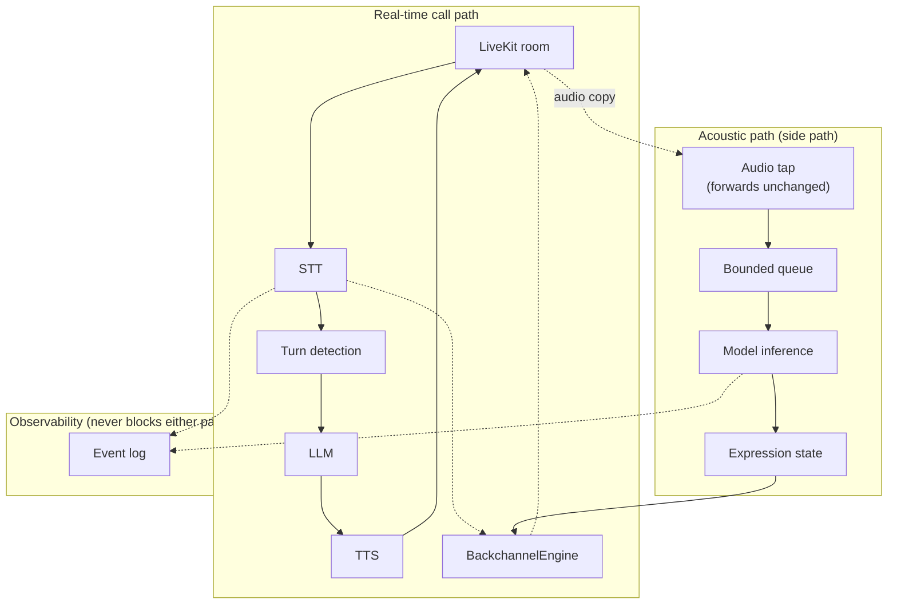

# Backchanneling + Real-Time Acoustic Intelligence for LiveKit Agents

Blue Machines SDE-1 assignment (Part 1) plus the Assignment 2 extension, **Real-Time Acoustic Intelligence** ([Part 2](#part-2-real-time-acoustic-intelligence)).

Part 1: a `BackchannelEngine` that lets a LiveKit voice agent say "mm-hmm" / "okay" / "right" while the user is still talking, without slowing down the agent's real response.

Part 2: a streaming acoustic-expression system on top of it, frustration/uncertainty/energy signals from prosody, not transcript, used to drive that same backchannel policy without joining the critical path.

All numbers below are from real benchmarks against real AWS services (Bedrock, Polly, Transcribe) and a real LiveKit Cloud project. Anything scripted rather than measured is labeled.

## Contents

1. [Architecture](#architecture)
2. [Backchannel decision policy](#backchannel-decision-policy)
3. [State machine](#state-machine)
4. [Race conditions & cancellation](#race-conditions--cancellation)
5. [Async task management](#async-task-management)
6. [Audio strategy](#audio-strategy)
7. [Benchmark methodology & fairness](#benchmark-methodology--fairness)
8. [Latency & behaviour metrics](#latency--behaviour-metrics)
9. [Results](#results)
10. [What became slower with backchanneling?](#what-became-slower-with-backchanneling)
11. [Known limitations](#known-limitations)
12. [Production considerations](#production-considerations)
13. [Bonus: TTS vs. cached audio, regression detection](#bonus-tts-vs-cached-audio-regression-detection)
14. [How to run everything](#how-to-run-everything)

---

## Architecture

```
apps/agent/                  Python 3.12, livekit-agents 1.8.3 + livekit-plugins-aws 1.8.3
  backchannel/
    engine.py                BackchannelEngine — decision policy + async lifecycle, no LiveKit imports
    state_machine.py          explicit EngineState transition table
    config.py                 every threshold, one dataclass, env/JSON overridable
    eot.py                    EndOfTurnEstimator — our own heuristic EOT-probability signal
    audio_provider.py         BackchannelAudioProvider ABC + CachedAudioProvider + TTSAudioProvider
    events.py                 shared Event/EventType schema
    instrumentation.py        EventRecorder: InMemory (tests) / Jsonl (live) / Sqlite (benchmark + UI)
  livekit_adapter.py          the only file that touches real LiveKit objects
  aws_providers.py            wires livekit-plugins-aws to real Bedrock/Polly/Transcribe
  worker.py                   LiveKit entrypoint — baseline & backchannel modes, mode from room metadata
  cached_clips/               pre-rendered Polly clips: mm-hmm, right, okay, yeah, got-it
  tests/                      pytest — all 15 required behaviors, no live network/AWS/LiveKit calls

benchmarks/                   scenarios.py, replay_runner.py, aggregate.py, regression_check.py, cli.py
apps/web/                     Next.js 15 + TypeScript — Overview, Scenarios, Compare, Run timeline, Live Demo
data/benchmark.sqlite         shared DB, written by Python, read-only from the web app
```

`backchannel/` has zero LiveKit imports. Every public method on `BackchannelEngine` takes plain data, and every effect goes through the `BackchannelAudioProvider` interface — that's what makes the engine unit-testable without a live connection, and keeps `livekit_adapter.py` a thin, auditable bridge instead of engine logic smeared across `AgentSession` callbacks.

```
mic → STT (Transcribe) → turn_detection="stt" → LLM (Nova) → TTS (Polly) → main audio track
        │  public AgentSession events: user_state_changed, user_input_transcribed, agent_state_changed
        ▼
  BackchannelEngine (pure Python)  →  play(phrase) / handle.stop()  →  BackgroundAudioPlayer
                                                                        (own audio track, public API)
```

The backchannel path is a **side branch**, not a stage in the main pipeline — the real response's STT→LLM→TTS chain never awaits anything the engine does. That's the entire architectural answer to "does backchanneling slow down the real response."

## Backchannel decision policy

Inputs, all from public events: speech duration this turn, time since the last transcript update, punctuation/continuation shape of the latest transcript, current `AgentState`, time since the last backchannel, backchannels so far this turn.

`tick()` computes an EOT-probability score (`0.6·silence + 0.3·punctuation + 0.1·duration`, each in `[0,1]`), then checks in order:

```
SUPPRESS if speech_duration_ms    < MIN_SPEECH_DURATION_MS          → "speech_too_short"
SUPPRESS if time_since_last_bc    < BACKCHANNEL_COOLDOWN_MS         → "cooldown_active"
SUPPRESS if eot_probability       >= MAX_EOT_PROBABILITY            → "high_eot_probability"
SUPPRESS if silence_gap_ms        >= EOT_SILENCE_WINDOW_MS - SUPPRESS_NEAR_EOT_MS → "near_eot_silence_window"
SUPPRESS if agent_state in (thinking, speaking)                     → "agent_responding"
SUPPRESS if backchannels_this_turn >= MAX_BACKCHANNELS_PER_TURN     → "max_backchannels_per_turn_reached"
otherwise SELECT, pick a phrase (not the last one used), schedule playback
```

Every decision is logged with `speechDurationMs`, `eotProbability`, `timeSinceLastBackchannelMs`, `agentState`, `reason: [...]`. All thresholds live in one place, `BackchannelConfig` (env/JSON overridable).

**Why not LiveKit's own EOT signal?** The installed `livekit-agents==1.8.3` wheel defines `EotPredictionEvent` and `_AgentBackchannelOpportunityEvent` internally, but neither is in the public `EventTypes` union `AgentSession.on()` can subscribe to — the source routes them to an internal `_session_host` with a `# TODO: replace with the public eot_prediction event once it lands` comment. Confirmed-private, unreleased, so we built our own estimator, which is what the brief asks for anyway.

## State machine

```
IDLE → USER_SPEAKING → BACKCHANNEL_CANDIDATE ─┬→ BACKCHANNEL_PENDING → BACKCHANNEL_PLAYING → USER_SPEAKING (clip finished)
              │                                └→ USER_SPEAKING (suppressed)
              ├→ EOT_DETECTED → AGENT_RESPONDING → IDLE
   (PENDING/PLAYING) → CANCELLED ─┬→ USER_SPEAKING (turn continues)
                                   └→ EOT_DETECTED
SHUTDOWN reachable from every state.
```

Explicit adjacency table (`state_machine.py`); illegal transitions raise `InvalidTransition` instead of silently no-op'ing. Includes a "false EOT" recovery path (`EOT_DETECTED → USER_SPEAKING`) for when the user resumes talking before the agent's real response starts.

## Race conditions & cancellation

The race the assignment poses directly: *backchannel selected → audio starts → user finishes → agent needs to respond.* **The real response always wins.** Two independent signals can trigger cancellation — user turn ending, or `AgentState` moving to `thinking`/`speaking` — either one is sufficient.

Cancellation is real `asyncio.Task.cancel()`, not a flag. `_play_backchannel()` wraps the entire attempt (including the network call for `TTSAudioProvider`) in one task; cancelling it raises `CancelledError` at whatever await point it's sitting on, mid-synthesis included. A test proves this directly: start a backchannel with an artificial synthesis delay, invalidate the turn mid-delay, assert playback never happened.

If nothing is audible yet, cancellation is unconditional. If a clip is already playing, the decision depends on `CANCEL_ON_EOT` (default `True`, stop immediately) vs. the soft alternative (`False`: let it finish if past `BACKCHANNEL_AUDIBLE_GRACE_MS`, logged as `BAD_BACKCHANNEL` for visibility). Either way, `_cancel_pending()` never stops the handle or logs the cancellation itself — cancelling the task is what makes `_play_backchannel`'s own handler do both, exactly once. (An earlier version did both from two places, double-counting every cancellation, and cancelled the task unconditionally before checking the policy, which silently broke the soft alternative. Both fixed, both covered by dedicated tests.)

Every candidate carries a `turn_id`/`decision_id`; a task that resolves after its turn has moved on checks staleness before ever marking the handle as playing.

## Async task management

STT/state events only update an in-memory snapshot, never schedule async work directly. One periodic evaluator (`engine.run()`) calls `tick()` at most every `MIN_TIME_BETWEEN_DECISIONS_MS` (200ms default); `tick()` bails immediately if a decision/playback is already in flight, so at most one backchannel is ever active. A test fires 200 interim-transcript events synchronously and asserts zero tasks were created.

`engine.shutdown()` cancels the evaluator and any pending playback task, awaits both, then transitions to `SHUTDOWN` — tested mid-STT-event, mid-generation, and mid-agent-response.

## Audio strategy

Two `BackchannelAudioProvider` implementations behind one interface:

- **`CachedAudioProvider`** (default) — plays a pre-rendered clip (`scripts/generate_cached_clips.py`, run once against Polly). No network round trip before "audible."
- **`TTSAudioProvider`** — synthesizes on demand via an injected callable. More flexible for new phrases/languages, but the synthesis latency sits directly in front of "audible" (see [Bonus](#bonus-tts-vs-cached-audio-regression-detection) for the measured cost).

`BackgroundAudioPlayer` (public LiveKit API) publishes its own independent audio track, never touches `ChatContext` — no code path exists from a backchannel into the LLM's conversation history, and a test greps the engine's own source to make sure that stays true.

## Benchmark methodology & fairness

10 deterministic scenarios (`benchmarks/scenarios.py`): short_answer, long_monologue, approaching_eot, mid_sentence_pause, fast_speaker, noisy_audio, long_speech_multiple_opportunities, user_stops_as_backchannel_about_to_play, cooldown_repeated_ack, agent_response_starts_immediately (8 required + 2 extra). Each is a scripted timeline of interim/final transcript events, identical for both configs.

For each `(scenario, config)`, `replay_runner.run_one()` feeds the script into `BackchannelEngine` (backchannel config only — baseline never constructs one, matching `worker.py`), then at turn-end fires the **real** pipeline: a real Bedrock streaming call, then a real Polly synthesis call. `--n N` runs this N times per pair (default 10; results below used N=6, 120 runs, disclosed for turnaround time).

**No live LiveKit room in the benchmark loop, on purpose** — that would add WebRTC jitter as a confound between configs. What's left is the engine's own overhead (a function call, for a cached clip) and the real AWS latencies, the thing actually worth comparing. Both configs share the same script, the same warmed-up Bedrock/Polly clients, the same prompt/model/voice config — the only code-level difference is whether a `BackchannelEngine` was constructed. `worker.py`'s baseline and backchannel modes call the exact same `build_session()`, asserted by a test that diffs the constructor kwargs from both paths. Real WebRTC jitter, mic quality, and multi-turn drift are out of scope for the numbers here; that's what `/live` is for.

## Latency & behaviour metrics

- **`response_latency_ms`** (the headline metric) = `TTS_FIRST_AUDIO − USER_SPEECH_END`.
- **`backchannel_latency_ms`** = `BACKCHANNEL_AUDIO_START − BACKCHANNEL_SELECTED`.
- **`llm_ttft_ms`** = `LLM_TTFT − LLM_START` (real Bedrock streaming TTFT).
- **`tts_first_audio_ms`** = `TTS_FIRST_AUDIO − TTS_START` (real Polly TTFA).
- **`stt_finalization_ms`** = scripted gap, not measured (no real Transcribe call in the benchmark loop).

**A backchannel is bad if:** it fires within `SUPPRESS_NEAR_EOT_MS` of the EOT cutoff (should be suppressed instead), its audio overlaps `AGENT_RESPONSE_START`, it plays after the user stopped speaking under the soft policy, it violates cooldown, or it measurably delays `LLM_START` (structurally impossible given the side-track architecture). Each is independently logged and countable per run.

## Results

Real run: 10 scenarios × 2 configs × 6 runs = 120 runs, every LLM/TTS call a real round trip. Run **twice** on identical code — the difference between the two runs turned out to be the most useful evidence in this section.

| Metric | Run 1: Baseline / Backchannel / Δ | Run 2: Baseline / Backchannel / Δ |
|---|---|---|
| Response latency P50 | 2239 / 2254 / +15ms | 2283 / 2294 / +10ms |
| Response latency P95 | 2819 / 2535 / **−285ms** | 2735 / 2848 / **+113ms** |
| LLM TTFT P50 | 1100 / 1098 / −1ms | 1134 / 1144 / +10ms |
| LLM TTFT P95 | 1397 / 1392 / −5ms | 1351 / 1501 / +150ms |
| TTS first audio P50 | 809 / 791 / −18ms | 797 / 787 / −10ms |
| TTS first audio P95 | 926 / 921 / −5ms | 1034 / 995 / −38ms |

**Backchannel behaviour, run 2 (pooled, n=60), mean / P50 / max:**

| Metric | Mean | P50 | Max |
|---|---|---|---|
| Backchannels per run | 0.80 | 1 | 2 |
| Cancelled per run | 0.20 | 0 | 1 |
| Bad backchannels per run | **0** | 0 | 0 |
| Suppressed candidates per run | 11.6 | 8 | 33 |
| User/agent overlap | **0 ms** | 0 | 0 |
| Decision → audible latency | 2.98 ms | 1 | 34.4 |

("Cancelled per run" dropped from 0.40 to 0.20 between runs — a real double-counting bug fixed in between, see [Race conditions](#race-conditions--cancellation).)

Per-scenario response-latency P50 deltas (run 2) ranged from −95ms to +126ms, no consistent direction, whether or not a backchannel actually fired that scenario.

## What became slower with backchanneling?

**Nothing that survives comparing the two runs.** Pooled P95 delta was **−285ms in run 1, +113ms in run 2** — same code, both times. A 400ms swing between two runs of identical code is bigger than either individual delta, which means neither is a real signal, it's AWS call-to-call variance dominating a comparison this size. That's the cleanest possible answer to "how do you know a 30ms difference is your system and not normal variance": here a 285ms difference didn't survive a second run.

The clearest single data point: `agent_response_starts_immediately` shows `backchannel_count = 0` in both configs, in both runs — no backchannel was ever selected, played, or cancelled — yet its P50 delta is −95ms. The only thing different in the backchannel config is an idle coroutine ticking every 200ms and finding nothing to do; that cannot move a real network call by 95ms. The delta is AWS variance, showing up whether or not the engine did anything, exactly the architectural claim that the backchannel path can't be what makes a run slower.

P50 deltas were more stable (+15ms, +10ms, both <0.7% of a ~2.3s response), consistent with "no real regression" without claiming a tight confidence interval — six samples per cell doesn't support one.

**What held cleanly across both runs, because these have no AWS variance to hide behind:** zero bad backchannels and zero milliseconds of measured overlap across all 120 backchannel runs, and 1–34ms decision-to-audible latency (mean ~3ms).

## Known limitations

- STT is scripted in the benchmark (no real Transcribe call against real audio there); the live agent uses real Transcribe.
- `EndOfTurnEstimator` is a hand-tuned heuristic, not a trained model — deterministic on purpose, but cruder than a real semantic turn-detector. Swappable via the `EndOfTurnEstimator` protocol.
- N=6 per cell — enough to see direction, not enough for a tight confidence interval.
- Live demo audio quality wasn't judged by ear in the dev environment (no mic/speakers there). Verified instead via a synthetic-participant script and inspection of a real browser session's event log (9 real backchannels, zero cancellations, zero errors). A human should still listen via `/live`.
- `BACKCHANNEL_AUDIO_END` in the live agent marks frame handoff to LiveKit's mixer, not audible completion (confirmed from real session logs: ~10-30ms vs. the clip's real ~600-700ms). Doesn't affect any benchmark number — the benchmark's `CachedAudioProvider` uses an explicit timer instead.
- Anthropic models on this AWS account are blocked pending an unsubmitted Bedrock form; Amazon Nova Micro was used instead.

## Production considerations

- **Audio caching**: validate clips exist at startup (already does); add a CI check.
- **Provider failures**: current handling is log-and-move-on per call; add a circuit breaker for repeated failures in one session.
- **Network jitter**: benchmark excludes it deliberately; production should track real WebRTC timing separately from engine decision latency.
- **Observability**: `EventRecorder → sqlite` works for one process; at scale this wants real tracing (span per turn, backchannel decisions as span events).
- **Cancellation at scale**: today's guarantee (stale task can't play audio) doesn't survive a process restart mid-turn.
- **Configurable policies per deployment**: `BackchannelConfig` already supports JSON/env overrides; next step is a policy registry keyed by customer/locale.
- **Multilingual**: `available_phrases()` is provider-level already — a new language is a new `CachedAudioProvider` pointed at a different clip directory.
- **Regression detection**: done as a bonus (below); still needs wiring into an actual CI job and a baseline that evolves deliberately rather than manually.
- **Privacy**: transcripts pass through `Event.metadata` into sqlite/JSONL unredacted — fine for scripted benchmark text, not for live customer audio without redaction first.

## Bonus: TTS vs. cached audio, regression detection

**Cached vs. generated TTS, measured** (`benchmarks/tts_vs_cached.py`, 15 real trials each):

```
                       mean       p50       p95       min       max
CachedAudioProvider    0.01ms    0.00ms    0.02ms    0.00ms    0.03ms
TTSAudioProvider     790.78ms  786.69ms  859.51ms  734.71ms  917.62ms
```

Cached is a file read; TTS is a real Polly round trip, ~790ms for a two-word phrase. That's most of a second added to what's supposed to feel like a reflex — the measured reason `CachedAudioProvider` is the default. Reproduce: `python -m benchmarks.tts_vs_cached --n 15`.

**Automatic regression detection** (`benchmarks/regression_check.py`): snapshots response-latency P50/P95 per (scenario, config) as a baseline, flags a later run only when a change clears **both** a 75ms absolute floor and a 12% relative floor — not either alone, since the Results section above shows P95 alone swinging 400ms from pure AWS variance between two identical runs. A looser checker would flag that every time. Verified it still catches a real regression by injecting a 400ms delta into a copy of the real data and confirming the right scenario/metric gets flagged, exit code 1.

```bash
python -m benchmarks.cli save-baseline
python -m benchmarks.cli check-regressions   # exit 0 clean, 1 on regression
```

## How to run everything

**Prerequisites**: Python 3.12 (not 3.14 — `livekit-agents` native deps aren't reliable there yet), Node 18+, an AWS account with Bedrock/Polly/Transcribe access, a LiveKit Cloud project.

**Credentials** — `apps/agent/.env` and `apps/web/.env.local`, both:
```
LIVEKIT_URL=wss://your-project.livekit.cloud
LIVEKIT_API_KEY=...
LIVEKIT_API_SECRET=...
```
AWS: resolves a named profile (`wavy` by default, change in `apps/agent/aws_providers.py`) and exports standard `AWS_ACCESS_KEY_ID`/`SECRET` env vars at import time. If your default profile already works with plain `boto3.client(...)`, you don't need this.

**Install**:
```bash
cd apps/agent && python3.12 -m venv .venv && source .venv/bin/activate && pip install -r requirements.txt
cd ../web && npm install
```

**Generate cached clips** (one-time, needs Polly): `cd apps/agent && python scripts/generate_cached_clips.py`

**Tests**:
```bash
cd apps/agent && source .venv/bin/activate && python -m pytest tests/ -v
apps/agent/.venv/bin/python -m pytest benchmarks/test_regression_check.py -v   # from repo root
cd apps/web && npx vitest run
```

**Benchmark**: `apps/agent/.venv/bin/python -m benchmarks.cli run --n 10` then `... report` (from repo root; `--n 6` was used for the checked-in results)

**Bonus checks**: `apps/agent/.venv/bin/python -m benchmarks.tts_vs_cached --n 15`, and `... cli save-baseline` / `... cli check-regressions`

**Dashboard**: `cd apps/web && npm run dev` → `http://localhost:3000/overview` (also `/scenarios`, `/compare`, `/live`, `/live-sessions`)

**Live agent**: `cd apps/agent && source .venv/bin/activate && python worker.py dev`, then open `/live`, pick a mode, connect, and talk. The web app tags a fresh room with the chosen mode via metadata; `worker.py` reads that to pick the pipeline.

**Manual room dispatch** (no browser): `cd apps/agent && python scripts/create_room.py my-test-room backchannel`

---

# Part 2: Real-Time Acoustic Intelligence

Streaming pipeline that listens to raw audio while the user talks and produces three signals: `frustration`, `uncertainty`, `energy`. These are **acoustically expressed conversational signals** derived from prosody (energy, pitch stability, pauses), never a claim about the speaker's true emotional state.

## Contents

1. [Architecture](#architecture-1)
2. [Model](#model)
3. [Streaming design](#streaming-design)
4. [Latency results](#latency-results)
5. [Smoothing](#smoothing)
6. [Acoustic vs. text](#acoustic-vs-text)
7. [Backchannel policy](#backchannel-policy)
8. [Reliability](#reliability)
9. [Per-call state](#per-call-state)
10. [Benchmarks](#benchmarks)
11. [Conversational performance](#conversational-performance)
12. [Production design](#production-design)
13. [Tests](#tests)
14. [Questions](#questions)
15. [Limitations](#limitations)
16. [How to run](#how-to-run)

## Architecture

New package, `apps/agent/acoustic/`:

```
types.py        prediction/state data model
config.py       every tunable, env/JSON overridable (ACOUSTIC_*)
model.py        the AcousticModel interface
mock_model.py   default model: fast DSP/prosody features
real_model.py   real pretrained wav2vec2 model (optional)
pipeline.py     AcousticStreamProcessor, buffering, cadence, backpressure
policy.py       the one backchannel decision this signal drives
text_baseline.py independent lexicon baseline for the acoustic-vs-text test
```

Extends Part 1 without touching it: `BackchannelEngine` gained one optional param and `on_expression_update()`; `livekit_adapter.py` gained a non-invasive audio tap and a data-channel publisher. All 34 Part 1 tests still pass unmodified.



The only arrow from the acoustic path back into the call is `Expr → BCE`, one in-memory read. If the acoustic path is fully down, that read returns a default and the call proceeds exactly as Part 1 did.

## Model

Two implementations behind one interface, swappable via `ACOUSTIC_MODEL_KIND`:

| | Real model | Default (mock) |
|---|---|---|
| What | `wav2vec2-base-superb-er`, pretrained, genuinely downloaded | Deterministic DSP: RMS energy, pitch (autocorrelation), spectral centroid, pauses |
| CPU latency (1.5s window, measured) | 118.9ms P50 / 134.8ms P95 | 19.8ms P50 / 32.6ms P95 |
| Why it's not the default | Too slow against a 250ms stride under real concurrency | 5-8x cheaper, always meets budget |
| What it represents | `frustration := P(angry)`; `uncertainty := softmax entropy` (weak proxy) | Hand-specified heuristic over real features, not a trained model |

`energy` is computed the same way regardless of model, direct RMS of the waveform, never a model prediction.

## Streaming design

| Param | Default | Why |
|---|---|---|
| `WINDOW_SIZE_MS` | 1500 | Biggest lever on latency vs. stability |
| `INFERENCE_STRIDE_MS` | 250 | New prediction ~4x/sec |
| `MIN_AUDIO_REQUIRED_MS` | 500 | First prediction of a turn, lower confidence |
| `MAX_QUEUE_SIZE` | 8 | Bounded ingestion, drop-oldest on overflow |
| `MAX_STALENESS_MS` | 800 | Drop a window that's already too old to submit |
| `INFERENCE_TIMEOUT_MS` | 500 | Cancel a stuck inference, don't wait forever |

Bigger window = smoother, slower. Smaller window = faster, noisier. 1500ms/250ms is where the DSP model stops being visibly noisy while still updating 4x/sec.

## Latency results

Model inference alone is not the true detection latency, the window-fill wait dominates. Measured across all 8 benchmark scenarios (`benchmarks/acoustic_scenario_report.py`, n=356):

| Stage | P50 | P95 |
|---|---:|---:|
| Audio wait (window fill) | 1581.8ms | 1640.2ms |
| Queue wait | 14.6ms | 23.1ms |
| Model inference | 19.8ms | 32.6ms |
| **Effective detection latency** | **1615.7ms** | **1713.2ms** |

~98% of detection latency is window-fill, not the model. Reproduce: `python -m benchmarks.acoustic_scenario_report --repeats 3` (no AWS needed, reads committed fixtures).

**Audio → UI**: the historical timeline (`/runs/[id]`) is verified with real data end to end. The live browser panel publishes over a LiveKit data-channel message and is implemented and type-checked, but wasn't exercised against a real browser + mic in this environment.

## Smoothing

Confidence-weighted exponential moving average, one method, chosen because it adds zero extra latency (a moving average would add a whole window's worth). Real example (`increasing_frustration` fixture):

| t (ms) | raw | smoothed |
|---:|---:|---:|
| 765 | 0.592 | 0.592 |
| 3083 | 0.561 | 0.626 |
| 7360 | 0.756 | 0.705 |
| 10142 | 0.736 | 0.752 |

Smoothed tracks the real upward trend while damping frame-to-frame noise.

## Acoustic vs. text

Five real Polly-TTS deliveries of the identical transcript ("Yeah, that's great."), text baseline computed once since it cannot see delivery:

| style | text signal | acoustic frustration | acoustic energy |
|---|---:|---:|---:|
| positive | constant | 0.619 | 0.691 |
| frustrated | constant | 0.654 | **0.774** |
| flat | constant | 0.562 | **0.406** |
| uncertain | constant | 0.589 | 0.534 |
| sarcastic | constant | 0.553 | 0.473 |

Text is identical across all five rows by construction. Energy separates styles cleanly, matching real RMS amplitude. Frustration's range is weaker (Polly's neural voice rejects SSML pitch control here, verified empirically), and sarcastic isn't clearly distinguishable from uncertain, an honest limitation, not hidden.

## Backchannel policy

The one real decision this signal drives:

```
IF frustration >= 0.70 AND confidence >= 0.60:
    cooldown *= 2.0            (fewer acknowledgements)
    only "mm-hmm"/"okay" allowed (no casual "yeah"/"right")
ELSE: no change
```

Never touches the LLM prompt. Tested at the threshold boundary and for the low-confidence no-op case.

## Reliability

- **Critical path never blocked**: the audio tap forwards frames before doing anything else; inference runs via `asyncio.to_thread`; every failure (crash, timeout, missing model) ends in "log and continue," never an exception that propagates.
- **Backpressure**: bounded queue drops the oldest frame on overflow, one inference in flight at a time, a stale window is dropped before submission, an independent watchdog cancels an inference that runs too long.
- **Fully isolated by design, not by luck**: disabling acoustic (`ENABLED=False`) is a config flag, zero tasks created. Verified live: a real 20-second session hit one real backpressure moment (a slow inference cancelled, two frames dropped) and recovered within one tick with no visible effect.

## Per-call state

Nothing here needs to survive a crash. Rolling audio buffer, prediction history, and smoothed state are all in-memory, recomputable from the live stream, and reset per call. Only the event log (JSONL/sqlite) survives past process exit, for observability, not correctness.

## Benchmarks

8 required scenarios, all real Amazon Polly neural-TTS audio (SSML rate/volume/pause, not human recordings, committed to `benchmarks/audio_fixtures/`): same words/different delivery, increasing frustration, hesitant speaker, high-energy speaker, flat delivery, background noise (synthetic noise added to real speech), long conversation (expression drifts within one turn), Hindi/Hinglish (best-effort, this AWS account has no `hi-IN` Polly voice).

Reproduce: `python -m benchmarks.acoustic_scenario_report --repeats 3`.

## Conversational performance

Does acoustic processing slow the core response? `benchmarks/acoustic_conversation_bench.py`, real AWS calls, n=8 per condition:

| Metric | OFF P50 | ON P50 | Δ | OFF P95 | ON P95 | Δ |
|---|---:|---:|---:|---:|---:|---:|
| Response latency | 2446ms | 2422ms | -24ms | 3103ms | 2604ms | -499ms |
| LLM TTFT | 1192ms | 1143ms | -49ms | 1322ms | 1198ms | -124ms |
| TTS first audio | 842ms | 823ms | -19ms | 978ms | 890ms | -89ms |

Every delta is negative. Read the same way Part 1 reads its own noisy deltas: real AWS variance dwarfs an effect this small. Honest conclusion: no measurable regression.

## Production design

**Capacity** (Fermi estimates, not vendor quotes): ~2 windows/sec/call average → ~2,000 windows/sec at 1,000 calls, ~20,000 at 10,000 calls. At a rough ~3,000 windows/sec/GPU, that's ~1-2 GPUs at 1k calls, ~7-10 at 10k, plus 30-50% headroom.

**Traffic spike** (4,000 → 12,000 calls, priority order): core conversation never degrades → backchanneling reduced → acoustic cadence reduced then disabled for new calls → analytics sampled/dropped first. Never the reverse.

**Multi-tenancy**: one codebase, `TenantConfig` (acoustic on/off, thresholds, languages, model version, deployment mode), no forks. Shared GPU queue is partitioned per tenant with a fair-share quota so one tenant can't starve another's acoustic signal, or the core call for anyone.

**Deployment** (cloud / VPC / on-prem): `AcousticModel` has no network dependency once weights are local, config loads from a local JSON file, `recorder=None` is fully supported. On-prem mainly changes what's outside this system (STT/LLM/TTS need local equivalents too).

**Model rollout**: version every prediction (already does), shadow-eval, percentage then tenant-level rollout, automatic rollback on latency or error-rate regression using the same dual-threshold logic as Part 1's own regression checker.

**Overload ladder**: NORMAL → DEGRADED (lower cadence) → HIGH LOAD (latest window only) → SEVERE (acoustic off for new calls) → CRITICAL (core voice only). Each level is strictly less than the one above; the core path never has a degradation level of its own.

## Tests

40 new tests, all passing, on top of Part 1's 34 (also still passing): streaming windows, smoothing, slow/failed inference, stale work dropped, queue overflow, disabled mode, clean shutdown, backchannel policy at the threshold boundary, LiveKit tap forwarding survives a callback exception.

```bash
cd apps/agent && python -m pytest tests/ -v
```

## Questions

| # | Question | Answer |
|---|---|---|
| 1 | Why this model? | Two: a real pretrained wav2vec2 model (genuinely benchmarked) and a fast DSP model that's actually the default, since the real one is too slow for the stride budget on CPU. |
| 2 | Earliest trustworthy point? | Not before 500ms of audio; confidence rises toward the full window; the policy requires confidence ≥ 0.60 to act. |
| 3 | True end-to-end latency? | 1616ms P50 / 1713ms P95, ~98% window-fill, not model. |
| 4 | Learning from words? | No, input is raw audio only; proven by identical-transcript, varying-delivery test showing a constant text score and a varying acoustic score. |
| 5 | Stability across windows? | Raw values swing ±0.1 between adjacent windows, visible in the smoothing table, which is why smoothing exists. |
| 6 | Under noise? | Tested with synthetic noise added to real speech; pipeline completes normally, accuracy under noise isn't separately claimed. |
| 7 | Accents/languages? | Mock model has no language assumptions; the real model was trained on English-only IEMOCAP; no `hi-IN` Polly voice was available to test real Hindi audio. |
| 8 | Prevent slowing the agent? | Structural: non-blocking tap, `asyncio.to_thread` inference, every failure isolated; measured OFF-vs-ON shows no regression. |
| 9 | Inference falls behind? | Cadence-based scheduling, stale windows dropped, oldest frames dropped first, never queued up. |
| 10 | Breaks first at 10k calls? | Likely STT/LLM/TTS provider limits before acoustic GPU capacity, which is the smaller number by design. |
| 11 | Change for 100k calls? | Move to a proper streaming ingestion tier and a real scheduler-level fair-share mechanism instead of queue partitioning. |
| 12 | Disabled first under overload? | Analytics, then acoustic expression. Never backchanneling or the core call. |
| 13 | State needing crash recovery? | None on the acoustic side; it's all safe to lose and recompute. |
| 14 | Air-gapped changes? | Almost nothing in `acoustic/` itself; the real change is STT/LLM/TTS needing local equivalents. |

## Limitations

- Mock model's frustration/uncertainty are a hand-tuned heuristic, not a validated classifier, and are coupled through energy.
- Real model's uncertainty proxy (softmax entropy) is weak; it was never trained to detect hesitation.
- Sarcasm is not reliably separated from uncertainty.
- Hindi/Hinglish fixture is an English voice reading Hinglish text, not real Hindi speech.
- Live browser panel implemented and type-checked, not exercised end to end with a real mic in this environment.
- Production architecture and capacity numbers are a design, not an implemented distributed system, as the assignment asked for.

## How to run

```bash
cd apps/agent && source .venv/bin/activate
python -m pytest tests/ -v                                    # 40 new + 34 existing

# From repo root, offline (reads committed fixtures):
apps/agent/.venv/bin/python -m benchmarks.acoustic_vs_text
apps/agent/.venv/bin/python -m benchmarks.acoustic_scenario_report --repeats 3

# Real AWS calls:
apps/agent/.venv/bin/python -m benchmarks.acoustic_conversation_bench --n 10
```

Live demo: `./start_demo.sh` from repo root, then open `/live`. Optional real-model dependency: `pip install -r requirements-real-model.txt`.
